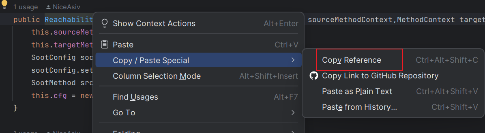
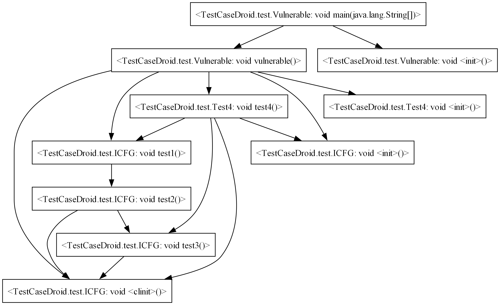

# TestCaseDroid

TestCaseDroid 是一个基于[Soot](https://github.com/soot-oss/soot)构建的项目，主要用于分析 Java 代码的可达性和构建调用图 (Call Graph)、控制流图 (Control Flow Graph) 和进程间控制流图 (Interprocedural Control Flow Graph)。

## 主要功能

1. **可达性分析**：通过 `Reachability*` 类，我们可以分析从一个方法到另一个方法是否可达。这对于理解代码的执行流程和找出潜在的代码问题非常有用。

2. **构建调用图**：通过 `BuildCallGraphForJar` 类，我们可以为指定的 Java 类或 Jar 文件构建调用图。

3. **构建控制流图**：通过 `BuildControlFlowGraph` 类，我们可以为指定的 Java 类构建控制流图。

4. **构建进程间控制流图**：通过 `BuildICFG` 类，我们可以为指定的 Java 类构建进程间控制流图。

## 如何使用

首先，你需要确保你的系统中已经安装了 Java 和 Maven，然后输出以下命令

```bash
mvn clean &&mvn install
```

然后，你可以通过以下命令来运行 TestCaseDroid：

```bash
java -jar TestCaseDroid-1.2.jar [options]
```

其中，`[options]` 是一系列的命令行选项，用于指定分析的类型、路径、类名等信息。具体的选项包括：

- `-p` 或 `--path`：指定要分析的 jar 包路径或者 class 文件路径,如果有多个路径，可以使用";"分隔。
- `-ec` 或 `--entryClass`：指定要分析的类名。
- `-sms` 或 `--sourceMethodSig`：指定要分析的源方法签名或者是IDEA中函数引用。
- `-tms` 或 `--targetMethodSig`：指定要分析的目标方法签名或者是IDEA中的函数引用。
- `-gt` 或 `--graphType`：选择需要生成的图类型。
- `-r` 或 `--reachability`：选择可达性分析类型。
- `-b` 或 `--backward`：是否进行逆向分析。
- `-m` 或 `--method`：选择要分析的方法名。
- `-ci`或 `--classInfo`: 提取相关类信息。
- `mn`或者`--methodName`:如果你如果无法直接获取IDEA的引用的话，那么推荐使用这个参数，并带上方法名来进行模糊搜索获取方法签名。

**注意**

IDEA引用获取方式如图右键点击函数



如果未发生重载则形式应该如下：

```bash
TestCaseDroid.test.CFG#method2
```

如果发生重载后的引用格式应该如下：

```bash
TestCaseDroid.test.CFG#method2(int)
TestCaseDroid.test.CFG#method2(java.lang.String)
TestCaseDroid.test.CFG#method2()
TestCaseDroid.test.CFG#method2(int, int)
```

### 图构建案例

#### CG

示例代码1

```java
public class ICFG {
    String inputFilePath;
    private static int graphType = 1;
    public void test1() {
        System.out.println("now in test1");
        test2();
    }
    public void test2() {
        System.out.println("now in test2");
        switch (graphType) {
            case 1:
                test3();
                break;
            case 2:
                System.out.println("graphType is 2");
                break;
            default:
                System.out.println("graphType is not 1 or 2");
        }
    }
    public void test3() {
        System.out.println("now in test3");
        if (graphType == 1) {
            System.out.println("graphType is 1");
        } else {
            System.out.println("graphType is not 1");
        }
    }
}
class Test4 {
    public void test4() {
        System.out.println("now in test4");
        ICFG icfg = new ICFG();
        icfg.test3();
        System.out.println("test4");
        icfg.test1();
    }
}
class Vulnerable {
    public void vulnerable() {
        System.out.println("--------------------");
        System.out.println("now in vulnerable");
        System.out.println("Start running the first test case");
        Test4 test4 = new Test4();
        test4.test4();
        System.out.println("End running the first test case");
        System.out.println("--------------------");
        System.out.println("Start running the second test case");
        ICFG icfg = new ICFG();
        icfg.test1();
        System.out.println("End running the second test case");
        System.out.println("--------------------");
    }
    public static void main(String[] args) {
        Vulnerable vulnerable = new Vulnerable();
        vulnerable.vulnerable();
    }
}
```

命令行输入

```shell
java -jar .\TestCaseDroid-1.2-jar-with-dependencies.jar -p "E:\Tutorial\TestCaseDroid\target\classes" -ec TestCaseDroid.test.Vulnerable -gt cg -sourceMethodSig "<TestCaseDroid.test.Vulnerable: void main(java.lang.String[])>"
```

输出结果

```shell
--------------------------------
The target class TestCaseDroid.test.Vulnerable is an Application class, loaded with 3 methods!
--------------------------------
Add 1 method in TestCaseDroid.test.Vulnerable as entrypoint!
    <TestCaseDroid.test.Vulnerable: void main(java.lang.String[])> is set as an entrypoint!
--------------------------------
Current entrypoint is:
[1] <TestCaseDroid.test.Vulnerable: void main(java.lang.String[])>
--------------------------------
Entry method: <TestCaseDroid.test.Vulnerable: void main(java.lang.String[])>
<TestCaseDroid.test.Vulnerable: void main(java.lang.String[])> may call <TestCaseDroid.test.Vulnerable: void vulnerable()>
<TestCaseDroid.test.Vulnerable: void main(java.lang.String[])> may call <TestCaseDroid.test.Vulnerable: void <init>()>
<TestCaseDroid.test.Vulnerable: void vulnerable()> may call <TestCaseDroid.test.ICFG: void test1()>
<TestCaseDroid.test.Vulnerable: void vulnerable()> may call <TestCaseDroid.test.ICFG: void <init>()>
<TestCaseDroid.test.Vulnerable: void vulnerable()> may call <TestCaseDroid.test.Test4: void test4()>
<TestCaseDroid.test.Vulnerable: void vulnerable()> may call <TestCaseDroid.test.Test4: void <init>()>
<TestCaseDroid.test.Vulnerable: void vulnerable()> may call <TestCaseDroid.test.ICFG: void <clinit>()>
<TestCaseDroid.test.ICFG: void test1()> may call <TestCaseDroid.test.ICFG: void test2()>
<TestCaseDroid.test.Test4: void test4()> may call <TestCaseDroid.test.ICFG: void test1()>
<TestCaseDroid.test.Test4: void test4()> may call <TestCaseDroid.test.ICFG: void test3()>
<TestCaseDroid.test.Test4: void test4()> may call <TestCaseDroid.test.ICFG: void <init>()>
<TestCaseDroid.test.Test4: void test4()> may call <TestCaseDroid.test.ICFG: void <clinit>()>
<TestCaseDroid.test.ICFG: void test2()> may call <TestCaseDroid.test.ICFG: void test3()>
<TestCaseDroid.test.ICFG: void test2()> may call <TestCaseDroid.test.ICFG: void <clinit>()>
<TestCaseDroid.test.ICFG: void test3()> may call <TestCaseDroid.test.ICFG: void <clinit>()>
Total number of edges: 15
Creating dot output folder：E:\tmp\.\sootOutput\dot\cg
Creating pic output folder：E:\tmp\.\sootOutput\pic\cg
```


基于Soot生成的示例代码1的调用图：




### **可达性分析案例**

#### CG

对于函数调用图（CG），我们需要将每个公共函数指定为入口方法，然后在这些方法之间获取完整的方法调用，并构建完整的调用图。在这里，我们已知的是目标方法的签名，可选的参数是需要寻找的入口函数的签名，如果给定入口函数的签名，那么直接在调用图中寻找所有可能的从源方法到目标方法的可能路径，反之则需要遍历入口函数，再去寻找满足需要的调用路径。

示例代码1

```java
public class ICFG {
    String inputFilePath;
    private static int graphType = 1;
    public void test1() {
        System.out.println("now in test1");
        test2();
    }
    public void test2() {
        System.out.println("now in test2");
        switch (graphType) {
            case 1:
                test3();
                break;
            case 2:
                System.out.println("graphType is 2");
                break;
            default:
                System.out.println("graphType is not 1 or 2");
        }
    }
    public void test3() {
        System.out.println("now in test3");
        if (graphType == 1) {
            System.out.println("graphType is 1");
        } else {
            System.out.println("graphType is not 1");
        }
    }
}
class Test4 {
    public void test4() {
        System.out.println("now in test4");
        ICFG icfg = new ICFG();
        icfg.test3();
        System.out.println("test4");
        icfg.test1();
    }
}
class Vulnerable {
    public void vulnerable() {
        System.out.println("--------------------");
        System.out.println("now in vulnerable");
        System.out.println("Start running the first test case");
        Test4 test4 = new Test4();
        test4.test4();
        System.out.println("End running the first test case");
        System.out.println("--------------------");
        System.out.println("Start running the second test case");
        ICFG icfg = new ICFG();
        icfg.test1();
        System.out.println("End running the second test case");
        System.out.println("--------------------");
    }
    public static void main(String[] args) {
        Vulnerable vulnerable = new Vulnerable();
        vulnerable.vulnerable();
    }
}
```

基于Soot生成的示例代码1的调用图：


命令行输入

```shell
java -jar TestCaseDroid-1.2-jar-with-dependencies.jar -path "E:\Tutorial\TestCaseDroid\target\classes" -entryClass TestCaseDroid.test.Vulnerable -reachability cg -sourceMethodSig "<TestCaseDroid.test.Vulnerable: void main(java.lang.String[])>" -targetMethodSig  "<TestCaseDroid.test.ICFG: void test2()>"
```

程序输出结果：

```java
Path found:
<TestCaseDroid.test.Vulnerable: void main(java.lang.String[])> -> <TestCaseDroid.test.Vulnerable: void vulnerable()> -> <TestCaseDroid.test.ICFG: void test1()> -> <TestCaseDroid.test.ICFG: void test2()>
Path found:
<TestCaseDroid.test.Vulnerable: void main(java.lang.String[])> -> <TestCaseDroid.test.Vulnerable: void vulnerable()> -> <TestCaseDroid.test.Test4: void test4()> -> <TestCaseDroid.test.ICFG: void test1()> -> <TestCaseDroid.test.ICFG: void test2()>
```

#### CFG

对于控制流图（CFG），我们需要的是更为精细化的标记路径，因此需要指定方法的起点基本块(方法签名)和终点基本块的方法调用签名。我们的目标是精简控制流图，使其仅包含对于当前分析目的有意义的控制链部分。下面是基于示例代码2的调用链搜索操作过程，

示例代码2

```java
public class CFG {
    private String CFGpath;
    private String CFGalgorithm;
    public void method2() {
        int b = 20;
        CFGpath = "Yet another useless assignment";  // Useless statement
        while (b > 0) {
            b--;
        }
        CFGalgorithm = "Final useless assignment";  // Useless statement
        if (b == 0) {
            method3();
        }
    }
    public void method3() {
    }
}
```

命令行输入

```shell
java -jar TestCaseDroid-1.2-jar-with-dependencies.jar -path "E:\Tutorial\TestCaseDroid\target\classes" -entryClass TestCaseDroid.test.CFG -reachability cfg -sourceMethodSig "<TestCaseDroid.test.CFG: void method2()>" -targetMethodSig  "<TestCaseDroid.test.CFG: void method3()>"
```

程序输出结果

```shell
The target method can be reached from the source method.
The path is: 
Reached node: virtualinvoke this.<TestCaseDroid.test.CFG: void method3()>() in method: null
Call stack: 
this := @this: TestCaseDroid.test.CFG
 -> b = 20
 -> this.<TestCaseDroid.test.CFG: java.lang.String CFGpath> = "Yet another useless assignment"
 -> if b <= 0 goto this.<TestCaseDroid.test.CFG: java.lang.String CFGalgorithm> = "Final useless assignment"
 -> $i0 = (int) -1
 -> this.<TestCaseDroid.test.CFG: java.lang.String CFGalgorithm> = "Final useless assignment"
 -> b = b + $i0
 -> if b != 0 goto return
 -> goto [?= (branch)]
 -> virtualinvoke this.<TestCaseDroid.test.CFG: void method3()>()
```

#### ICFG

使用ICFG图搜索从源方法到目标方法的调用路径路径，参考CG可达性分析，寻找从`TestCaseDroid.test.Vulnerable: void main(java.lang.String[])`到`TestCaseDroid.test.ICFG: void test1()`的调用路径。

输入参数

```bash
java -jar TestCaseDroid-1.2-jar-with-dependencies.jar -p E:\Tutorial\TestCaseDroid\target\classes\ -ec TestCaseDroid.test.Vulnerable -r icfg -sms "<TestCaseDroid.test.Vulnerable: void main(java.lang.String[])>" -tms  "<TestCaseDroid.test.ICFG: void test1()>"
```

实际的方法调用路径应如下


程序输出的路径结果

```bash
Reached node: virtualinvoke this.<TestCaseDroid.test.ICFG: void test2()>() in method: <TestCaseDroid.test.ICFG: void test1()>
Call stack: args := @parameter0: java.lang.String[]
 -> args := @parameter0: java.lang.String[]
 -> $stack2 = new TestCaseDroid.test.Vulnerable
 -> specialinvoke $stack2.<TestCaseDroid.test.Vulnerable: void <init>()>()
 -> virtualinvoke $stack2.<TestCaseDroid.test.Vulnerable: void vulnerable()>()
 -> this := @this: TestCaseDroid.test.Vulnerable
 -> $stack3 = <java.lang.System: java.io.PrintStream out>
 -> virtualinvoke $stack3.<java.io.PrintStream: void println(java.lang.String)>("--------------------")
 -> $stack4 = <java.lang.System: java.io.PrintStream out>
 -> virtualinvoke $stack4.<java.io.PrintStream: void println(java.lang.String)>("now in vulnerable")
 -> $stack5 = <java.lang.System: java.io.PrintStream out>
 -> virtualinvoke $stack5.<java.io.PrintStream: void println(java.lang.String)>("Start running the first test case")
 -> $stack6 = new TestCaseDroid.test.Test4
 -> specialinvoke $stack6.<TestCaseDroid.test.Test4: void <init>()>()
 -> virtualinvoke $stack6.<TestCaseDroid.test.Test4: void test4()>()
 -> $stack7 = <java.lang.System: java.io.PrintStream out>
 -> virtualinvoke $stack7.<java.io.PrintStream: void println(java.lang.String)>("End running the first test case")
 -> $stack8 = <java.lang.System: java.io.PrintStream out>
 -> virtualinvoke $stack8.<java.io.PrintStream: void println(java.lang.String)>("--------------------")
 -> $stack9 = <java.lang.System: java.io.PrintStream out>
 -> virtualinvoke $stack9.<java.io.PrintStream: void println(java.lang.String)>("Start running the second test case")
 -> $stack10 = new TestCaseDroid.test.ICFG
 -> specialinvoke $stack10.<TestCaseDroid.test.ICFG: void <init>()>()
 -> virtualinvoke $stack10.<TestCaseDroid.test.ICFG: void test1()>()
 -> this := @this: TestCaseDroid.test.ICFG
 -> $stack1 = <java.lang.System: java.io.PrintStream out>
 -> virtualinvoke $stack1.<java.io.PrintStream: void println(java.lang.String)>("now in test1")

```


## 贡献

欢迎对 TestCaseDroid 项目进行贡献。如果你有任何问题或建议，可以通过 GitHub 提交 issue 或 pull request。

# TestCaseDroid

TestCaseDroid is a project built on [Soot](https://github.com/soot-oss/soot), mainly used for analyzing the reachability of Java code and building Call Graph, Control Flow Graph, and Interprocedural Control Flow Graph.

## Main Features

1. **Reachability Analysis**: Through the `ReachabilityICFG` class, we can analyze whether one method is reachable from another. This is very useful for understanding the execution flow of the code and finding potential code problems.

2. **Building Call Graph**: Through the `BuildCallGraphForJar` class, we can build a call graph for a specified Java class or Jar file.

3. **Building Control Flow Graph**: Through the `BuildControlFlowGraph` class, we can build a control flow graph for a specified Java class.

4. **Building Interprocedural Control Flow Graph**: Through the `BuildICFG` class, we can build an interprocedural control flow graph for a specified Java class.

## How to Use

First, you need to make sure that Java and Maven are installed on your system.

```bash
mvn clean &&mvn install
```

Then, you can run TestCaseDroid with the following command:

```bash
java -jar TestCaseDroid-1.2.jar [options]
```

Where, `[options]` is a series of command line options for specifying the type of analysis, path, class name, etc. The specific options include:

- `-p` or `--path`: Specify the path of the jar package or class file to be analyzed.
- `-ec` or `--entryClass`: Specify the class name to be analyzed.
- `-sms` or `--sourceMethodSig`: Specify the source method signature to be analyzed.
- `-tms` or `--targetMethodSig`: Specify the target method signature to be analyzed.
- `-gt` or `--graphType`: Select the type of graph to analyze.
- `-r` or `--reachability`: Select the type of reachability analysis.
- `-b` or `--backward`: Whether to perform reverse analysis.
- `-m` or `--method`: Select the method name to be analyzed.

## Contribution

Contributions to the TestCaseDroid project are welcome. If you have any questions or suggestions, you can submit an issue or pull request on GitHub.