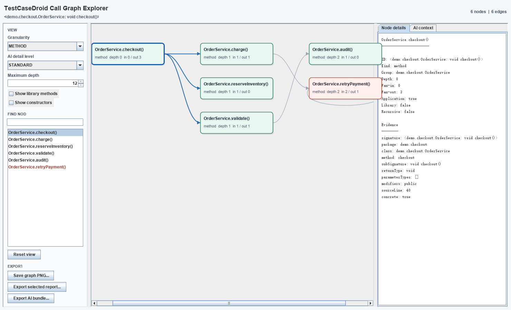
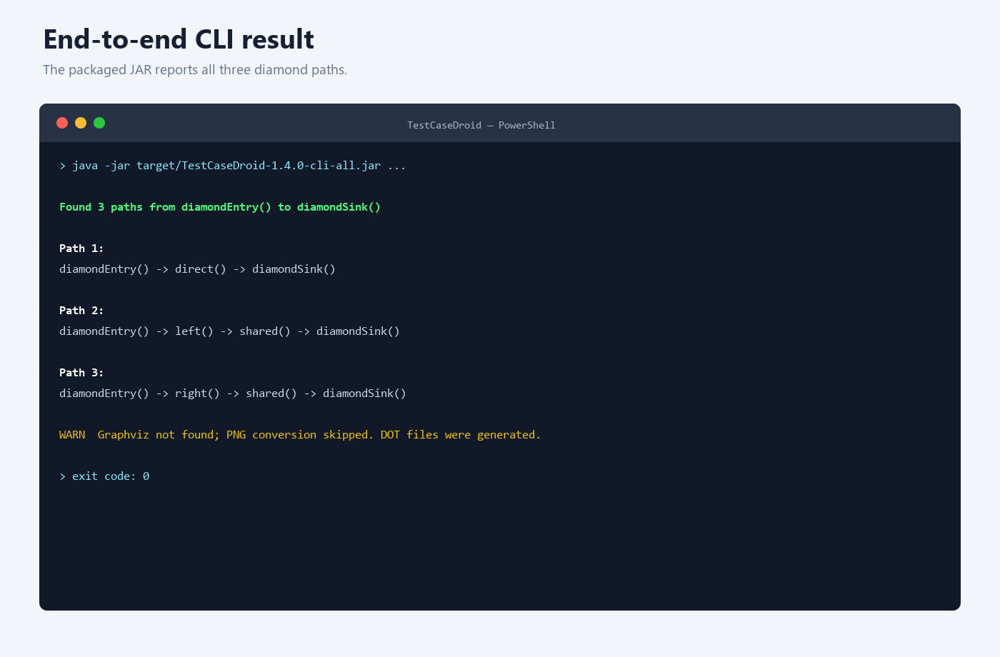
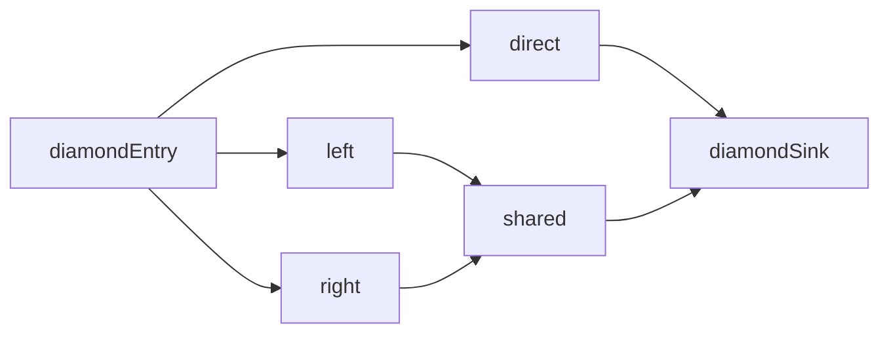
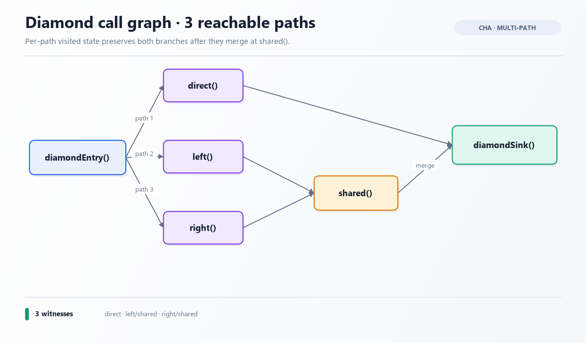
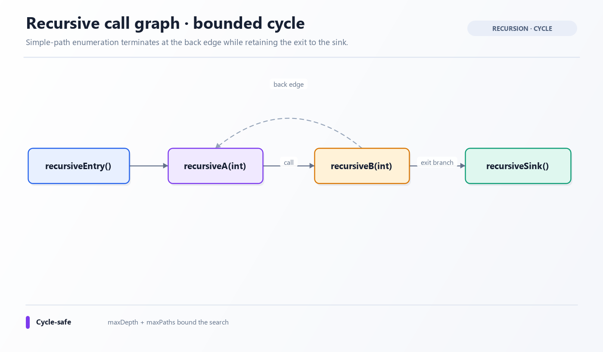
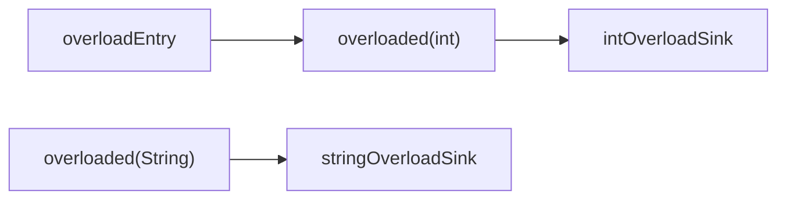
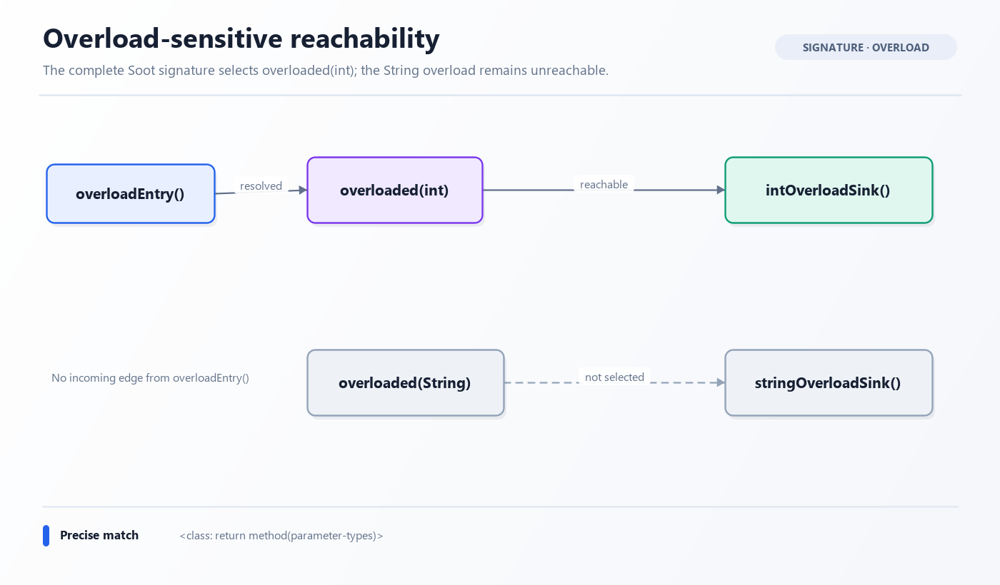
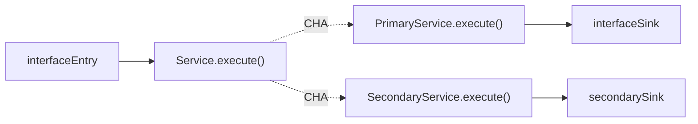
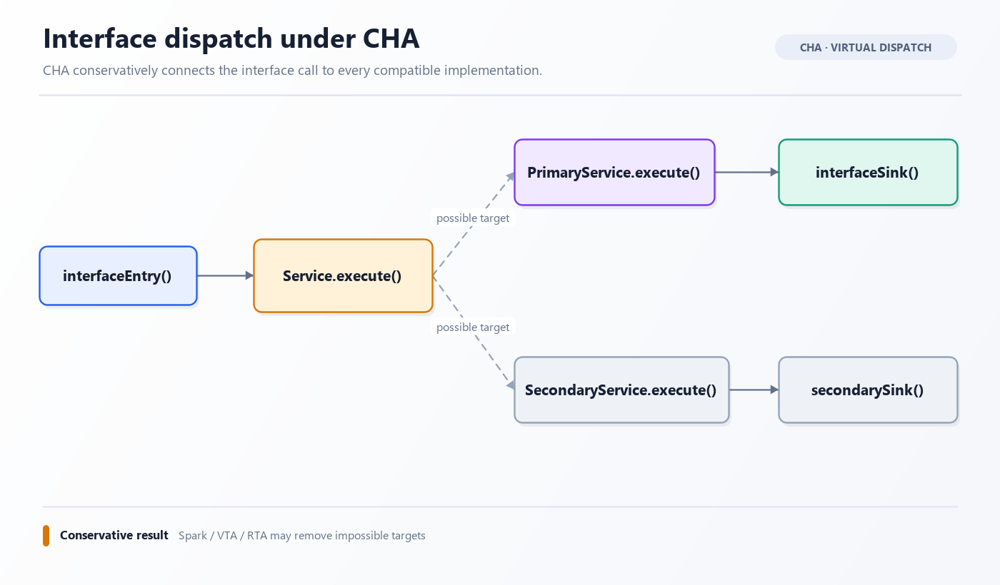

# TestCaseDroid

TestCaseDroid 是一个基于 [Soot](https://github.com/soot-oss/soot) 的 Java 静态分析工具，可构建调用图（CG）、控制流图（CFG）和过程间控制流图（ICFG），并查询方法或调用点之间的可达路径。

项目适合用于学习静态分析、检查调用链、制作小型分析原型。当前版本重点修复了旧实现中的 Soot 全局状态污染、多路径丢失、递归不终止、ICFG 调用/返回不匹配、固定本机路径测试等问题。

## 功能概览

| 能力 | CLI 参数 | 含义 |
| --- | --- | --- |
| 构建调用图 | `--graphType cg` | 从指定入口方法导出方法调用关系 |
| 构建美化 CFG | `--graphType cfg` | 导出单个方法的控制流图 |
| 构建原始 CFG | `--graphType rcfg` | 导出 Soot 原始控制流图 |
| 构建 ICFG | `--graphType icfg` | 导出跨方法的控制流关系 |
| CG 可达性 | `--reachability cg` | 枚举调用图中的有界简单路径 |
| CFG 可达性 | `--reachability cfg` | 查找源方法内能够到达目标调用点的真实 CFG 路径 |
| ICFG 可达性 | `--reachability icfg` | 按调用边和匹配返回边搜索跨过程路径 |
| 逆向可达性 | `--reachability bicfg` | 从目标沿调用者关系回溯到源方法 |
| Java 桌面可视化 | `--visualize` | 打开可缩放、可筛选、可检索的 Swing 调用图查看器 |
| AI 分层报告 | `--reportOutput` | 输出 UTF-8 JSON 与 Markdown，包含摘要、方法和调用点三档上下文 |
| 签名搜索 | `--methodName` | 按方法名或 IDEA 引用解析 Soot 签名 |
| 类信息 | `--classInfo true` | 输出类、字段和方法信息 |

调用图支持 `CHA`（默认）、`Spark`、`VTA` 和 `RTA`：

| 算法 | 特点 | 适合场景 |
| --- | --- | --- |
| CHA | 快、保守，虚调用候选通常较多 | 初次分析、教学、追求召回率 |
| Spark | 基于指针分析，通常比 CHA 精确 | 需要减少虚调用误报 |
| VTA | 基于变量类型分析 | 精度与成本折中 |
| RTA | 只考虑可能实例化的类型 | 快速缩小 CHA 结果 |

## 环境与构建

推荐环境：

- JDK 11（产物目标字节码为 Java 8）
- Maven 3.8+
- Graphviz（可选；没有 Graphviz 仍会生成 `.dot` 文件，只是不能自动转成 PNG）

运行全部测试：

```bash
mvn clean test
```

打包 CLI/GUI、thin/all 四种 JAR：

```bash
mvn clean package
```

产物位于：

```text
target/
├── TestCaseDroid-1.4.0.jar           # CLI thin
├── TestCaseDroid-1.4.0-cli-all.jar   # CLI，自带全部依赖
├── TestCaseDroid-1.4.0-gui.jar       # GUI thin
├── TestCaseDroid-1.4.0-gui-all.jar   # GUI，自带全部依赖
└── lib/                              # 两个 thin JAR 共用的运行依赖
```

`*-all.jar` 可以单独复制运行；thin JAR 体积更小，但旁边必须保留
Maven 生成的 `lib/`。CLI 与 GUI 使用不同的 `Main-Class`，GUI 不带参数时
直接打开分析配置窗口。

| 版本 | 是否自带依赖 | 启动行为 |
| --- | --- | --- |
| CLI thin | 否，读取相邻 `lib/` | 命令行分析与报告导出 |
| CLI all | 是 | 单文件命令行工具，适合服务器和脚本 |
| GUI thin | 否，读取相邻 `lib/` | 打开 Swing 分析配置窗口 |
| GUI all | 是 | 单文件桌面工具，适合直接下载使用 |

查看 CLI 帮助：

```bash
java -jar target/TestCaseDroid-1.4.0-cli-all.jar --help
```

## 命令行参数

| 短参数 | 长参数 | 说明 |
| --- | --- | --- |
| `-p` | `--path` | 待分析的 classes 目录或 JAR；多个条目使用当前系统的 classpath 分隔符 |
| `-ec` | `--entryClass` | 分析入口类的全限定名 |
| `-sms` | `--sourceMethodSig` | 源/入口方法的 Soot 签名或 IDEA 引用 |
| `-tms` | `--targetMethodSig` | 目标方法的 Soot 签名或 IDEA 引用 |
| `-gt` | `--graphType` | `cg`、`cfg`、`rcfg` 或 `icfg` |
| `-r` | `--reachability` | `cg`、`cfg`、`icfg` 或 `bicfg` |
| `-cga` | `--callGraphAlgorithm` | `CHA`、`Spark`、`VTA` 或 `RTA` |
| `-viz` | `--visualize` | 打开 Java Swing 调用图查看器 |
| `-ro` | `--reportOutput` | AI 报告输出目录；不指定档位时生成推荐的三档报告包 |
| `-dl` | `--detailLevel` | `summary`、`standard` 或 `detailed` |
| `-gr` | `--granularity` | `package`、`class`、`method` 或 `call-site` |
|  | `--maxDepth` | 调用图提取深度上限，默认 `12` |
|  | `--maxNodes` | 方法节点上限，默认 `2000` |
|  | `--includeLibraries` | 将第三方库/JDK 方法加入快照 |
|  | `--includeConstructors` | 将构造器和类初始化器加入快照 |
| `-mn` | `--methodName` | 模糊搜索方法名，或解析 IDEA 引用 |
| `-ci` | `--classInfo` | 传 `true` 时提取类信息 |
| `-h` | `--help` | 显示帮助 |

### 方法签名

Soot 完整签名：

```text
<TestCaseDroid.test.callgraph.CallGraphExamples: void diamondEntry()>
<TestCaseDroid.test.CFG: void method2(int)>
```

也可以直接使用 IDEA 风格引用：

```text
TestCaseDroid.test.CFG#method2(int)
TestCaseDroid.test.CFG#method2(java.lang.String)
TestCaseDroid.test.CFG#method2()
```

没有参数列表的引用（例如 `CFG#method2`）只会在方法名唯一时解析；存在重载时返回“未找到”，避免静默选择错误的方法。

## Java 调用图可视化器

先打包项目，然后直接启动独立 GUI：

```bash
java -jar target/TestCaseDroid-1.4.0-gui-all.jar
```

GUI 首屏可以选择 classes 目录或 JAR、入口类、入口方法、调用图算法和
分析边界。也可以将分析参数直接交给 GUI JAR：

```bash
java -jar target/TestCaseDroid-1.4.0-gui-all.jar \
  --path target/classes \
  --entryClass TestCaseDroid.test.callgraph.CallGraphExamples \
  --sourceMethodSig "TestCaseDroid.test.callgraph.CallGraphExamples#diamondEntry()"
```

Windows PowerShell 可以将上面的 `\` 换成反引号，或写在同一行。



界面提供：

- `package`、`class`、`method`、`call-site` 四级结构切换；
- 深度、库方法、构造器筛选，以及节点搜索与定位；
- 鼠标拖拽平移，`Ctrl + 滚轮` 缩放，点击节点查看入边、出边、签名和调用点证据；
- 递归节点、应用节点、库节点和调用点采用不同视觉编码；
- 当前图导出 PNG，所选档位导出 JSON/Markdown，或一次导出完整 AI 报告包。

库方法和构造器必须在提取快照时加入，才能在界面中随时开关：

```bash
java -jar target/TestCaseDroid-1.4.0-gui-all.jar \
  --path target/classes \
  --entryClass TestCaseDroid.test.callgraph.CallGraphExamples \
  --sourceMethodSig "TestCaseDroid.test.callgraph.CallGraphExamples#interfaceEntry()" \
  --includeLibraries \
  --includeConstructors \
  --maxDepth 8 \
  --maxNodes 1000
```

## 面向 AI 的分层调用图

只指定输出目录时，会生成推荐的六个文件：

```bash
java -jar target/TestCaseDroid-1.4.0-cli-all.jar \
  --path target/classes \
  --entryClass TestCaseDroid.test.callgraph.CallGraphExamples \
  --sourceMethodSig "TestCaseDroid.test.callgraph.CallGraphExamples#diamondEntry()" \
  --reportOutput sootOutput/reports
```

```text
sootOutput/reports/
├── callgraph-summary-package.json
├── callgraph-summary-package.md
├── callgraph-standard-method.json
├── callgraph-standard-method.md
├── callgraph-detailed-call-site.json
└── callgraph-detailed-call-site.md
```

三种详细程度：

| 档位 | 默认信息预算 | 适合 AI 做什么 |
| --- | ---: | --- |
| `summary` | 最多 80 节点 / 160 边，省略调用点正文 | 快速理解模块边界、挑选下一步分析范围 |
| `standard` | 最多 800 节点 / 1600 边，包含方法签名与调用类型 | 影响分析、可达性推理、识别入口/叶子/枢纽 |
| `detailed` | 最多 10000 节点 / 20000 边，包含源码行和调用语句 | 代码审查、生成带证据的解释、精确追踪调用点 |

四种结构粒度与详细程度相互独立：

| 粒度 | 节点表示 | 典型用途 |
| --- | --- | --- |
| `package` | 包 | 系统级架构概览 |
| `class` | 类 | 组件依赖和职责边界 |
| `method` | 方法 | 常规调用链与影响分析 |
| `call-site` | 方法与调用语句 | 一条边来自哪一行、哪种分派 |

也可以只生成指定组合：

```bash
java -jar target/TestCaseDroid-1.4.0-cli-all.jar \
  --path target/classes \
  --entryClass TestCaseDroid.test.callgraph.CallGraphExamples \
  --sourceMethodSig "TestCaseDroid.test.callgraph.CallGraphExamples#recursiveEntry()" \
  --reportOutput sootOutput/reports \
  --detailLevel detailed \
  --granularity call-site
```

每份报告都包含稳定的 `testcasedroid.callgraph/1.0` schema、入口和算法、节点/边指标、报告覆盖率、遗漏数量、递归强连通分量、高扇入/高扇出节点、不可达应用方法和静态分析警告。AI 因而可以区分“确定没有边”“报告预算省略了边”和“分析本身触及上限”。

推荐读取顺序是：先读 `summary-package.md` 选择关注区域，再读 `standard-method.json` 做拓扑推理，最后只在需要源码证据时读取 `detailed-call-site.json`。

## 快速示例

仓库内置了无第三方依赖的分析样例：

```text
TestCaseDroid.test.callgraph.CallGraphExamples
```

先执行 `mvn package`，然后可直接分析 `target/classes`。

### 生成调用图

```bash
java -jar target/TestCaseDroid-1.4.0-cli-all.jar --path target/classes --entryClass TestCaseDroid.test.callgraph.CallGraphExamples --graphType cg --sourceMethodSig "TestCaseDroid.test.callgraph.CallGraphExamples#diamondEntry()" --callGraphAlgorithm CHA
```

### 查询 CG 多路径

```bash
java -jar target/TestCaseDroid-1.4.0-cli-all.jar --path target/classes --entryClass TestCaseDroid.test.callgraph.CallGraphExamples --reachability cg --sourceMethodSig "TestCaseDroid.test.callgraph.CallGraphExamples#diamondEntry()" --targetMethodSig "TestCaseDroid.test.callgraph.CallGraphExamples#diamondSink()"
```

该样例会找到三条路径：

```text
diamondEntry -> direct -> diamondSink
diamondEntry -> left -> shared -> diamondSink
diamondEntry -> right -> shared -> diamondSink
```



### 查询单方法 CFG 中的调用点

```bash
java -jar target/TestCaseDroid-1.4.0-cli-all.jar --path target/classes --entryClass TestCaseDroid.test.callgraph.CallGraphExamples --reachability cfg --sourceMethodSig "TestCaseDroid.test.callgraph.CallGraphExamples#cfgEntry(int)" --targetMethodSig "TestCaseDroid.test.callgraph.CallGraphExamples#cfgSink()"
```

### 查询过程间可达性

```bash
java -jar target/TestCaseDroid-1.4.0-cli-all.jar --path target/classes --entryClass TestCaseDroid.test.callgraph.CallGraphExamples --reachability icfg --sourceMethodSig "TestCaseDroid.test.callgraph.CallGraphExamples#recursiveEntry()" --targetMethodSig "TestCaseDroid.test.callgraph.CallGraphExamples#recursiveSink()"
```

## 调用图样例形状

测试和 README 使用同一份源码，位于
`src/main/java/TestCaseDroid/test/callgraph/CallGraphExamples.java`。
下列 PNG 均由 `tools/ReadmeDiagramRenderer.java` 从相同图结构确定性生成，
可以随代码更新后重新渲染。

### 直连与菱形汇合


```mermaid
flowchart LR
    E[diamondEntry] --> D[direct]
    D --> S[diamondSink]
    E --> L[left]
    E --> R[right]
    L --> M[shared]
    R --> M
    M --> S
```



搜索使用“每条路径自己的已访问集合”，因此 `shared` 不会被全局 visited 提前吞掉，左右两条合法路径都会保留。

### 递归调用环


```mermaid
flowchart LR
    E[recursiveEntry] --> A[recursiveA]
    A --> B[recursiveB]
    B --> A
    B --> S[recursiveSink]
```



CG 搜索只枚举简单方法路径，并受 `maxDepth`、`maxPaths` 限制，所以遇到递归或互递归时能够终止。ICFG 进一步保留调用点的返回位置，返回边只会回到对应调用点。

### 重载


```mermaid
flowchart LR
    E[overloadEntry] --> I["overloaded(int)"]
    I --> IS[intOverloadSink]
    T["overloaded(String)"] --> TS[stringOverloadSink]
```



签名匹配包含参数类型，因此从 `overloadEntry` 可以到达 `intOverloadSink`，但不能到达 `stringOverloadSink`。

### 接口动态分派


```mermaid
flowchart LR
    E[interfaceEntry] --> API["Service.execute()"]
    API -. CHA .-> P["PrimaryService.execute()"]
    API -. CHA .-> S["SecondaryService.execute()"]
    P --> PS[interfaceSink]
    S --> SS[secondarySink]
```



CHA 会保守地保留兼容实现；Spark、VTA 或 RTA 通常可以减少候选边。静态分析结果表示“可能调用”，不是某次运行一定发生的调用。

## Java API

CG 可达性：

```java
String classes = "target/classes";
String clazz = "TestCaseDroid.test.callgraph.CallGraphExamples";

ReachabilityCG analysis = new ReachabilityCG(
        clazz,
        "<TestCaseDroid.test.callgraph.CallGraphExamples: void diamondSink()>",
        "<TestCaseDroid.test.callgraph.CallGraphExamples: void diamondEntry()>",
        classes
);
analysis.setMaxDepth(20);
analysis.setMaxPaths(100);

List<MethodContext> paths = analysis.analyzeCallGraph(
        analysis.getSourceMethodContext(),
        analysis.getTargetMethodContext()
);
```

ICFG 可达性：

```java
ReachabilityICFG analysis = new ReachabilityICFG(clazz, classes);
SootMethod source = Scene.v().getMethod(
        "<TestCaseDroid.test.callgraph.CallGraphExamples: void recursiveEntry()>");
SootMethod target = Scene.v().getMethod(
        "<TestCaseDroid.test.callgraph.CallGraphExamples: void recursiveSink()>");

List<Context> paths = analysis.inDynamicExtent(source, target);
boolean reachable = !paths.isEmpty();
```

注意：Soot 使用 JVM 全局单例。`SootConfig` 每次分析前会执行 `G.reset()`，并串行化配置过程。不要保存一个分析的 `SootMethod`，然后启动另一个分析再继续使用旧对象。

## 输出

默认输出目录：

```text
sootOutput/
├── dot/
│   ├── cg/
│   ├── cfg/
│   ├── icfg/
│   └── reachability/
├── pic/
    ├── cg/
    ├── cfg/
    ├── icfg/
    └── reachability/
└── reports/                  # 可选：UTF-8 JSON / Markdown AI 调用图
```

`.dot` 是权威输出。安装 Graphviz 并确保 `dot` 位于 `PATH` 后，工具会同时生成 PNG。

## 测试

测试不再依赖开发者机器上的 `E:\...` 路径，全部使用 Maven 的 `target/classes`，可以在 Windows、Linux 和 macOS 的 CI 中运行。

当前覆盖：

- 方法签名：普通方法、构造器、类初始化器、非法格式、泛型参数
- IDEA 引用：无参、重载、泛型擦除、歧义检测、连续解析状态隔离
- CG：直连、菱形多路径、共享节点、递归环、深度限制、重载、接口分派、不可达节点
- CFG：分支、循环、目标调用点、不可达调用点、路径图与 witness 一一对应
- ICFG：跨过程调用/返回、递归退出、不可达方法
- 逆向分析：调用者链与非祖先方法
- Soot 配置：场景重置、显式入口点、无效 classpath、无效算法
- 报告与可视化：四级图聚合、深度/库过滤、三档 JSON/Markdown、UTF-8、无窗口 PNG 渲染

运行单类测试（PowerShell 中建议给 `-Dtest` 参数加引号）：

```bash
mvn test "-Dtest=TestCaseDroid.analysis.reachability.ReachabilityCGTest"
```

测试报告位于 `target/surefire-reports`。

## 语义与限制

- CG、CHA、RTA、VTA、Spark 都可能产生误报；“可达”表示在所选抽象下可能存在路径。
- CFG 分析只检查源方法内部是否能够执行到目标方法的调用语句，不会进入被调方法。
- ICFG 会进入被调方法并匹配返回位置，但不进行常量传播、路径条件求解或完整异常建模。
- 反射、动态类加载、JNI、`invokedynamic`、框架隐式入口点可能需要额外建模。
- `allow_phantom_refs` 默认开启，缺失依赖不会立刻终止分析，但相应调用边可能不完整。
- 为防止路径爆炸，路径枚举有深度和数量上限；API 可通过 `setMaxDepth`、`setMaxPaths` 调整。
- 多个 classpath 条目必须使用当前系统的 `File.pathSeparator`：Windows 为 `;`，Linux/macOS 为 `:`。

## 项目结构

```text
src/main/java/TestCaseDroid/
├── analysis/
│   ├── info/                 # 类信息与方法签名搜索
│   ├── reachability/         # CG / CFG / ICFG / backward reachability
│   └── report/               # 调用图快照、聚合、洞察和 AI 报告
├── config/SootConfig.java    # Soot 场景、classpath、入口点与算法配置
├── graph/                    # CG / CFG / ICFG 导出
├── test/callgraph/           # 可直接分析的调用图样例
├── utils/                    # DOT、文件和 Soot 辅助工具
├── visualization/            # 纯 Java Swing 调用图查看器
└── TestCaseDroidApplication.java
```

## CI 与自动发布

仓库包含两条 GitHub Actions 流水线：

- `CI`：在 Ubuntu/Windows、Java 11/17 上执行测试、打包并逐一冒烟测试四种 JAR；
- `Release`：收到与 Maven 版本一致的 `v*` 标签后，上传四种 JAR、共享依赖 ZIP、CLI/GUI 便携包和 `SHA256SUMS.txt`，同时生成 GitHub artifact attestation。

发布一个版本：

```bash
git tag -a v1.4.0 -m "TestCaseDroid 1.4.0"
git push origin v1.4.0
```

随后可从 [GitHub Releases](https://github.com/NiceAsiv/TestCaseDroid/releases) 下载：

```text
TestCaseDroid-1.4.0-cli.jar
TestCaseDroid-1.4.0-cli-all.jar
TestCaseDroid-1.4.0-gui.jar
TestCaseDroid-1.4.0-gui-all.jar
TestCaseDroid-1.4.0-dependencies.zip
TestCaseDroid-1.4.0-cli-portable.zip
TestCaseDroid-1.4.0-cli-portable.tar.gz
TestCaseDroid-1.4.0-gui-portable.zip
TestCaseDroid-1.4.0-gui-portable.tar.gz
SHA256SUMS.txt
```

thin JAR 必须与共享依赖 ZIP 解压出的 `lib/` 并列；`*-all.jar` 可以单文件运行。便携包已经包含相应 all JAR 和 `bin/` 启动脚本。完整的选择建议、版本号规则、手动重跑和产物验证方法见 [RELEASING.md](./RELEASING.md)。

更详细的 Soot 学习笔记见 [Soot.md](./Soot.md)，相关课程资料位于 `Lecture/`。

## 常见问题

**提示找不到类**

确认 `--path` 指向编译后的 classes 目录或 JAR，而不是源码目录；Maven 项目通常是 `target/classes`。

**方法引用解析失败**

重载方法必须带完整参数列表。内部类使用 JVM/Soot 类名时通常包含 `$`。

**只有 DOT，没有 PNG**

安装 Graphviz，并确认终端执行 `dot -V` 成功。DOT 生成不依赖 Graphviz。

**调用图边太多**

CHA 是保守算法。尝试 `--callGraphAlgorithm Spark`、`VTA` 或 `RTA`，并确保分析 classpath 完整。

**可视化界面无法打开**

确认当前环境有桌面显示服务，并且没有设置 `-Djava.awt.headless=true`。服务器或 CI 环境请使用 `--reportOutput` 和 PNG 导出。

## License

[MIT](./LICENSE)
