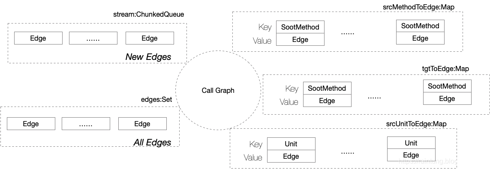

# Soot

适合参考的文档和教程如下：

[北京大学软件分析技术](https://xiongyingfei.github.io/SA/2022/main.htm)

[南京大学软件分析](https://ranger-nju.gitbook.io/static-program-analysis-book/)

[Tutorials for soot](https://github.com/soot-oss/soot/wiki/Tutorials)

[McGill University](https://www.sable.mcgill.ca/soot/tutorial/index.html)

[198:515 (vt.edu)](https://people.cs.vt.edu/ryder/515/f05/lectures/)

比较好的笔记资料：

[南京大学《软件分析》课程笔记](https://ling-yuchen.github.io/2022/07/14/NJU-Static-Analysis/)

比较好的入门作业或者案例：

[CSCE710  Assignment 1](https://o2lab.github.io/710/p/a1.html)

基于Soot的拓展项目：

[ByteCodeDL](https://github.com/BytecodeDL/ByteCodeDL/discussions)：使用soot生成fact，使用souffle作为datalog引擎，最后使用neo4j进行可视化，实现了多种程序分析算法；(个人觉得讨论区的案例是比较有价值的)

[Tabby](https://github.com/wh1t3p1g/tabby)：基于soot生成代码属性图，应用案例比较多

## 简介

[Soot](https://github.com/soot-oss/soot)是McGill大学的Sable研究小组自1996年开始开发的Java字节码分析工具，它提供了多种字节码分析和变换功能，通过它可以进行过程内和过程间的分析优化，以及程序流图的生成，还能通过图形化的方式输出，让用户对程序有个直观的了解。尤其是做单元测试的时候，可以很方便的通过这个生成控制流图然后进行测试用例的覆盖，显著提高效率。


**Soot是java优化框架，提供4种中间代码来分析和转换字节码。**

soot一共支持4种IR（imtermediate representation），分别是:

- Baf：精简的字节码(bytecode)表示，操作简单，主要用来插桩类

```assembly
iload 1  // load variable x1, and push it on the stack
iload 2  // load variable x2, and push it on the stack
iadd     // pop two values, and push their sum on the stack
istore 1 // pop a value from the stack, and store it in variable x1
```

- Jimple：适用于优化的3-address(简单理解两个输入一个输出)中间表示,可以用来做各种优化需要的分析，比如类型推测(虚调用优化）、边界检查消除、常量分析以及传播、公共子串分析等等

```assembly
stack1 = x1 // iload 1
stack2 = x2 // iload 2
stack1 = stack1 + stack2 // iadd
x1 = stack1 // istore 1
```

- Shimple：Jimple的SSA(Static Single Assignment)变体,每个“变量”只被赋值一次，而且用前会定义，这可以用来做各种reaching分析，比如一个“变量”作用域，进而分析例如内联inline时需要进行的检查等等
- Grimple：Jimple的聚合版本，不再要求表达式树线性排布（也就是按照三地址码一条一条写下来），因此减少了一些中间变量，同时也引入了`new`这个operator，适用于反编译和代码检查。


**SSA(Static Single Assignment)**

SSA即为“静态单一分配”，SSA中的所有赋值都有不同名称的变量，详细解释如下：

- 每个定义需要给定一个新的名字；

- 将新名称传播给后续使用；

- 每个变量都只有一个定义。


**一般生成SSA要比3AC慢很多，但是有时可以利用SSA来提高非敏感数据流分析的精度。**


> 为什么要使用中间表示？
>
> 如果直接使用Java bytecode
>
> - 😨 太贴近机器器码（为执⾏而设计）
> - 😭 语句句类型大约有200种（⾄至多有256条指令）
> - 😫 基于栈的代码


**Soot提供的输入输出格式**

输入格式：

- java（bytecode and source code up to Java 7）
- android字节码
- Jimple中间表示
- Jasmin，低级中间表示
- soot提供的分析功能

输出格式：

- java 字节码
- android字节码
- Jimple
- Jasmin


**Soot提供的分析功能**

- 调用图构建
- 指针分析
- Def/use chains
- 模板驱动的程序内数据流分析
- 模板驱动的程序间数据流分析，与heros结合
- 别名可以使用基于流、字段和上下文敏感的需求驱动指针分析Boomerang解析
- 结合FlowDroid或IDEal的污染分析


## 原理解析

Soot的执行过程如下


### 基本数据结构

#### **Overview**

上述数据结构的总览图如下


#### Data structures


Scene：分析环境

- 代表 Soot 输入程序的整个运行、分析、变换的环境。通过 Scene 类，你可以设置应用程序类（供 Soot 进行分析的类）、主类（包含 main 方法的类）以及访问关于程序间分析的信息（例如，指向信息和调用图）。


SootClass：代表了加载到 Soot 中或使用 Soot 创建的单个类，特别的SootClass有以下3类：

- argument class为我们自己写的程序入口，通过这个class来配置编译选项等并启动soot分析框架
- application class为待分析的java程序
- library class为soot库函数


SootField：类中的成员字段，或者是类的属性


SootMethod：类中的单个方法

#### Method Body

Body：用来表示方法的实现，在Soot中，一个Body(不同的IR，有着不同的Body表现形式，如JimpleBody)隶属于一个SootMethod，即Soot用一个Body为一个方法存储代码。

每个Body里面有三个主链，分别由 Locals 链（`body.getLocals()`）、Units 链（`body.getUnits()`）、Traps 链（`body.getTraps()`）组成。

- Locals 链存储方法中的局部变量,可以通过body.getLocals()访问。
- Units 链存储代码片段的接口
- Traps 链存储方法中异常处理的接口


根据上图，可知jimple body对象还可以调用`getUnits()`方法来获得Units Chain上所有的Units，每个Unit就是jimple body之中的一条语句。


#### Statements

Soot中的Statements或者声明是用接口 Unit 表示，所以有不同的接口实现，因为有不同的中间表示。

Unit 在 Jimple 中的实现是 Stmt(在Grimple中一个Inst是一个Unit)，并且这些类型都继承了Unit这个类。因此可以直接用instanceof来判断一条语句到底是identityStmt(特殊值，如参数、this或被捕获的异常，分配给一个Local)类型，assignStmt类型(赋值语句)或者其他的什么类型。

Stmt可以分为15种具体的语句类型：


注意：AssignStmt 表示赋值语句；而 IdentityStmt表示变量是参数或者this等

```java
public int foo(java.lang.String) {
    // locals
    r0 := @this; // IdentityStmt
    r1 := @parameter0;
    if r1 != null goto label0; // IfStmt
    $i0 = r1.length(); // AssignStmt
    r1.toUpperCase(); // InvokeStmt
    return $i0; // ReturnStmt
label0: // created by Printer
    return 2;
}
```


#### Value

单个数据表示为值或者Value，实现了Value接口的类有：

**Local(局部变量)**

- **JimpleLocal** 局部变量

- **TemporaryRegisterLocal** 以`$`开头的临时变量

```java
java.lang.String[] r0; //Local
int i0, i1, i2, $i3, $i4;
java.io.PrintStream $r1, $r2;
java.lang.Exception $r3, r4;
```

**Constant(常量)**，常用`StringConstant`和`NumericConstant`。

**Expression(Expr)**,表示各种运算。Expr接口又有大量的实现，例如NewExpr和AddExpr。一般来说，一个Expr对一个或几个Value进行一些操作，并返回另一个Value，比如下面这个表达式，在这个AssignStmt中，它的leftOp是 x，rightOp是 AddExpr（y+2）。

```java
x = y + 2 //AssignStmt 
```

**Ref** 

- **ConcreteRef**

  - ArrayRef 指向数组

  - FieldRef 指向field
    - StaticFieldRef 静态field的引用
    - InstanceFieldRef 指向的field是一个对象实例

- **IdentityRef**

  - **CaughtExcrptionRef** 指向捕获到的异常的引用

  - **ParameterRef** 函数参数的引用`@parameter`，`a.f`

  - **ThisRef** this的引用，`@this`


#### Box

Box：可以看做指向数组的指针，当Unit包含另一个Unit的时候，需要通过Box来访问

- 包括 UnitBox(指向Units)、ValueBox(指向Values)

从下图可以看出

- **一个 Unit 可以有多个 UnitBox，但是每个 UnitBox 只能指向一个 Unit**。

- **一个Value可以有多个ValueBox，但是每个ValueBox只能指向一个Value**，对于一个Unit，可以得到很多个ValueBox，包含着这条语句内部的所用到的以及和所定义的值。

  


在上图中可以注意到`i1=0` 等于是一个Stmt, i0是一个Valuebox，里面包含这`i0`这个local 的value

**常用方法**

```java
public List<ValueBox> getUseBoxes();	//返回 Unit 中使用的 Value 的引用
public List<ValueBox> getDefBoxes();	//返回 Unit 中定义的 Value 的引用
public List<ValueBox> getUseAndDefBox();//返回 Unit 中定义并使用的 Value 的引用
```

以List of [ValueBox](#Box)的形式返回。

```java
// 一般 Value 指的是 Local（变量）、Expr（表达式）、Constant（常量）
public List geUnitBoxes();				//获得 Unit 跳转到的 UnitxBox 列表
public List getBoxesPointingTothis();	//Unit 作为跳转对象时，获取所有跳转到该 Unit 的 UnitBox
public boolean fallsThrough();			//如果接下来执行后面的 Unit，则为 true
public boolean branches();				//如果执行时会跳转到其他 Unit，则返回 true。如：IfStmt、GotoStmt
public void rediectJumpsToThisTo(Unit newLocation);//把跳转到 Unit 重定向到 newLocation
```

通过以上的方法我们能够确定**跳转到这个Unit的其他Unit**（调用`getBoxesPointingToThis()`），也可以找到**跳到的其他Unit**（调用`getUnitBoxes()`）。


### 主流IR Jimple

**Jimple 是什么？**

Jimple 是 Soot 提供的一种中间表示形式，它是基于栈的、有类型的、基于三地址的表示。与 Java 字节码相比，Jimple 更接近源代码的结构，因为它是直接从字节码操作翻译而来的。Jimple 的特点包括：

- **基于栈**：Jimple 使用操作数栈来存储中间结果和临时变量，这使得它更接近 Java 源代码的结构。
- **有类型**：每个参数都有明确的类型声明，这有助于保留源代码中的类型信息，避免了类型精度的丢失。
- **基于三地址分析**：复杂的表达式会被转化成一系列的基本操作，即三地址码。每个操作包含一个目标变量和两个操作数，这种形式便于后续的分析和转换。


在Soot中，主要是基于Jimple进行分析，在流程中构建的是JimpleBody,而其它的Body的构建需要通过开关来控制。

Java 字节码是底层的、基于栈的操作形式，而 Jimple 更接近源代码的结构。让我们来看一个简单的示例来对比两者之间的区别：

**Java 源代码：**

```java
int i, j;
i = 2;
j = 2 * i + 8;
```

**Java 字节码：**

```java
0: iconst_2
1: istore_1
2: iconst_2
3: iload_1
4: imul
5: bipush 8
6: iadd
7: istore_2
```

Jimple 代码：

```java
int i, j, temp$0, temp$1, temp$2, temp$3;

temp$0 = 2;
i = temp$0;

temp$1 = 2 * i;
temp$2 = temp$1;

temp$3 = temp$2 + 8;
j = temp$3;
```

### Soot执行阶段

在Soot中，Soot的执行分为几个称为packs的阶段。首先要生成Jimple代码，以便输入到一系列的转换函数（也称为Pack）中。

每个Pack的命名都是有规律可循的，按照约定，命名方式通常包括以下几个部分：

- **全局模式设置(可选)**：字母缩写的是"w"。

- **IR类型**: 在过程内执行中，第一个字母代表中间表示（Intermediate Representation）的类型。
  - j --> Jimple
  - s --> Shimple
  - b --> Baf
  - g --> Grimp

- **角色**: 第二个字母表示Pack在整个分析过程中所扮演的角色。例如，"b" 代表Body Creation（创建方法体），"o" 代表Optimization（优化），"t" 代表User-defined Transformation（用户定义的转换），"a" 代表Attribute generation(属性生成)等。
- **后缀**: 通常最后一个字母是 "p"，表示这是一个Pack。

例如，"jtp" 表示在Jimple阶段应用用户定义的转换，"bbp" 表示在Jimple阶段对方法体应用用户定义的转换，"stp" 表示在Shimple阶段应用用户定义的转换。

#### 过程(程序)内执行


上面这张图是过程内执行执行流程图。在这个执行流程中，每个应用程序类都会按照一条路径进行处理，但它们无法访问其他应用程序类处理过程生成的任何信息。换句话说，每个应用程序类的处理过程是相互独立的，它们之间没有共享的信息或状态。

默认情况下，黑色的线表示的是默认打开的Pack，而红色的线表示可以通过添加编译选项来打开的Pack。**用户可以在转换阶段添加自己的分析相关操作，即在Jimple Transformation Pack（jtp）阶段实现。**

例如，在jtp 阶段添加一个小的自定义的Transformer，可以输出程序中所有class和method的名称等信息。这在PackManager注册后会在适当的阶段执行，并且Soot的执行流执行完自定义的myTransform后，将继续沿着执行流执行。

```java
import soot.*;
import soot.options.Options;
import java.util.*;

public class JimpleAnalysis {
    public static void main(String[] args) {
        // 设置 Soot 选项
        Options.v().set_src_prec(Options.src_prec_java);
        Options.v().set_output_format(Options.output_format_jimple);
        
        // 加载需要分析的类
        SootClass myClass = Scene.v().loadClassAndSupport("MyClass");
        
        // 在jtp阶段添加自定义的Transformer
        PackManager.v().getPack("jtp").add(new Transform("jtp.myTransformer", new SceneTransformer() {
            @Override
            protected void internalTransform(String phaseName, Map<String, String> options) {
                // 输出所有类的名称
                System.out.println("Classes:");
                for (SootClass clazz : Scene.v().getClasses()) {
                    System.out.println(clazz.getName());
                }
                
                // 输出每个类中的方法名称
                System.out.println("Methods:");
                for (SootClass clazz : Scene.v().getClasses()) {
                    System.out.println("Class: " + clazz.getName());
                    for (SootMethod method : clazz.getMethods()) {
                        System.out.println("    Method: " + method.getName());
                    }
                }
            }
        }));
        
        // 运行Soot分析
        PackManager.v().runPacks();
    }
}
```

##### 数据流分析

###### 控制流图CFG

一个CFG是表示**一个方法内**的程序执行流的图，它由一系列基本块（edu.xjtu.TestCaseDroid.basic block）组成，其中每个基本块是一组按顺序执行的语句。控制流图中的节点通常代表基本块，而边则表示程序执行的控制流转移，例如条件语句、循环或函数调用等。例如语句A执行后的下一条语句是B，则CFG中应有一条从A到B的有向边。

- 通常所有的控制流分析（Control Flow Analysis）指的就是创建控制流图（Control Flow Graph）； 
- CFG是静态程序分析的基本结构；
- CFG中的节点可以是单独的3AC，或者是基本块（BB，Basic Block）；


###### **什么是数据流分析**

How *application-specific Data*（abstraction） *Flows*（safe-approximation） through the *Nodes* （Transfer function）and *Edges*（Control-flow handling） of CFG？

- 这里的Application-specific Data指的就是我们静态分析时关注的抽象（Abstraction）数据，例如进行污点分析时，我们关注的就是污点对象；

- Node通常通过转换函数（Transfer functions）进行分析处理，例如函数调用（Method Call），形参到返回值的转换处理；

- Edge的分析也就是Control-flow处理，例如GOTO等指令的处理；

- 不同的数据流分析存在不同的抽象数据（data abstraction）、不同的safe-approximation策略、不同的tranfer functions以及不同的control-flow handings。

例如，如果我们关注程序变量的正负等状态，那么此时的Application-specific Data指的就是表示变量状态的一些抽象符号；Transfer functions指的就是各种加减乘除运算；Control-flow handing指的就是merges处的符号合并。


###### 数据流分析前驱知识

**Input and Output States**

- 每一个IR的执行，都会将input state 转换成output state
- input(output) state和statement之前(之后)的program point相关；

- 数据流分析就是，对于程序中的所有IN[s]和OUT[s]，需要找到一个方法去解析一系列的safe-approximation约束规则；这些约束规则基于语句的语义（transfer functions）或者控制流（flows of control）。


**Transfer Function’s Constraints**

- Transfer Function’s Constraints即基于转换函数的约束规则，主要分为两种，一种是Forward Analysis，另外一种就是Backward Analysis；

- 对于Forward Analysis来讲，IN[s]经过转换函数fs的处理，可以得到OUT[s]；

- 对于Backward Analysis来讲，OUT[s]经过转换函数fs的处理，可以得到IN[s]。


**Control Flow’s Constraints**

- Control Flow’s Constraints即基于控制流的约束规则，主要体现在BB之间以及BB之内；

- 对于 `IN[Si+1] = OUT[Si]` ，要说明的含义其实就是，对于每一个statement，后一个statement的输入就是前一个statement的输出；因为BB中的statement不能存在分叉啥的，所以能这么认为；

- 对于 `IN[B] = IN[S1]` 以及 `OUT[B] = OUT[Sn]` ，要说明的含义其实就是，对于每一个BB，其输入就是第一个statement的输入，其输出就是最后一个statement的输出。


###### 可达性分析

可达呀？可达鸭！


TODO

###### 活跃变量分析

TODO

###### 可用表达式分析

TODO

#### 过程(程序)间执行


##### **Jimple Body Creation**

首先，Soot 会将 jb  pack应用于每个具有程序Body的方法。本地方法如 System.currentTimeMillis() 是没有Body的。jb  pack是固定的，它负责创建 Jimple 表示。它不能被改变！

##### **全局模式（Whole-program mode）**

在这种模式下，Soot在执行周期中包含另外三个packs：cg（call-graph generation）、wjtp（whole Jimple transformation pack）和wjap（whole Jimple annotation pack）。此外，为了添加整个程序的优化（例如静态内联），我们可以指定-W选项，进一步将wjop（whole Jimple annotation pack）添加到混合中。

- `cg`，即调用图包，使用各种构建算法构建调用图，不同模式下构建调用图的方式不同，详细参数见[此处](https://soot-build.cs.uni-paderborn.de/public/origin/master/soot/soot-master/3.0.0/options/soot_options.htm#phase_5)。

  简单获取cg图的方法：

  

  

  

- `wjtp`，即整个Jimple转换包。这是您应该插入==任何跨过程/整个程序分析==的主要包。当它执行时，调用图已经被计算出来，可以立即访问。

- `wjop`，即整个Jimple优化包。如果您希望根据您的整个程序分析结果实现代码优化或其他Jimple IR的转换，则应使用此包。

- `wjap`，即整个Jimple注释包，可用于用额外的元数据注释Jimple语句。此元数据可以持久化在Java字节码属性中。

所有这些 packs 都可以更改，特别是可以向这些 packs 添加 [SceneTransformers](https://www.sable.mcgill.ca/soot/doc/soot/SceneTransformer.html)，这些 SceneTransformers 进行整个程序分析。SceneTransformer 通过 `Scene` 访问程序，以便分析和转换程序。下面的代码片段向 wjtp 包添加了一个伪Transformer：

```java
public static void main(String[] args) {
  PackManager.v().getPack("wjtp").add(
      new Transform("wjtp.myTransform", new SceneTransformer() {
        protected void internalTransform(String phaseName,
            Map options) {
          System.err.println(Scene.v().getApplicationClasses());
        }
      }));
  soot.Main.main(args);
}
```

##### **jtb && jop && jap Pack**

**jtp**默认是可用且是空的。通常在这里进行==过程内分析(intra-procedural edu.xjtu.TestCaseDroid.analysis)==。

**jop**包含一套Jimple优化操作。它默认未启用，可以通过Soot的命令行 **-o** 或者 **-p jop enabled** 来启用。

**jap**是Jimple的注释(annotation)包。每个Jimple body里都可以加入注释，这样你或者其他人或JVM便可以评估优化的结果。这个包默认是启用的，但该包中所有的阶段(phases)默认未启用，因此，如果你把你的分析添加到这个包里，默认会自动启用。

==请注意，添加到（non-whole）Jimple 包的每个 Transform 必须是 BodyTransformer。==

比如以下代码片段启用了空指针标记器，并注册了一个新的 BodyTransformer，该转换器会打印出每个方法中每个语句的标记：

```java
public static void main(String[] args) {
  PackManager.v().getPack("jap").add(
      new Transform("jap.myTransform", new BodyTransformer() {

        protected void internalTransform(Body body, String phase, Map options) {
          for (Unit u : body.getUnits()) {
            System.out.println(u.getTags());
          }
        }

      }));
  Options.v().set_verbose(true);
  PhaseOptions.v().setPhaseOption("jap.npc", "on");
  soot.Main.main(args);
}

```

##### bb && tag Pack

Soot接下来对每个body应用**bb**和**tag** Pack。**bb**  Pack将优化并打了标签(optimized anf tagger)的Jimple bodies转换成Baf bodies。Baf是Soot里一种基于栈的中间表示，通过Baf，Soot创建字节码。**tag** Pack汇聚特定的标签(aggregates certain tags)。比如说，如果有多条Jimple(或者Baf)语句共享同一个行号标签，那么Soot便只会在第一条含有这个标签的语句上保留这个标签，保证唯一性。


###### 其他

想要了解详细过程解释可以查看[Prof. Dr. Eric Bodden » Packs and phases in Soot](http://www.bodden.de/2008/11/26/soot-packs/)

各种Pack由类PackManager管理，其init方法负责创建各Pack实例对 象，并为之添加变换器。下面我列举了Soot中的部分Pack。

| Pack名 | 所属的Pack类                     | 说明                                  |
| ------ | -------------------------------- | ------------------------------------- |
| jb     | JimpleBodyPack(BodyPack的子类)   | 创建Jimple体                          |
| jj     | JavaToJimplePack(BodyPack的子类) | 实现Java到Jimple的转换                |
| cg     | CallGraphPack(由ScenePack派生)   | 调用图生成、指针分析、类层析分析(CHA) |
| wstp   | ScenePack                        | 全局Shimple变换包                     |
| wsop   | ScenePack                        | 全局Shimple优化包                     |
| wjtp   | ScenePack                        | 全局Jimple转换包                      |
| wjop   | ScenePack                        | 全局Jimple优化包                      |
| wjap   | ScenePack                        | 全局Jimple注释包                      |
| jtp    | BodyPack                         | Jimple转换包                          |
| jop    | BodyPack                         | Jimple优化包                          |
| jap    | BodyPack                         | Jimple注释包                          |
| tag    | BodyPack                         | 代码属性tag聚集包                     |


使用[命令行](#命令行使用)进行阶段定制

阶段选项是可以应用于Soot中不同packs的配置，以定制它们在分析过程中的行为。以下是如何在Soot中与阶段选项进行交互的方法：

1. **列出可用的packs**：
   - 要获取Soot中所有可用packs的列表，您可以在命令行中执行命令`java soot.Main -pl`。
2. **获取特定pack的帮助**：
   - 您可以通过使用命令`java soot.Main -ph PACK`来获取特定pack的帮助和可用选项，其中`PACK`是从使用`-pl`选项运行Soot时列出的pack名称之一。
3. **为pack设置选项**：
   - 要为pack设置选项，您需要使用`-p`选项，后面跟着pack名称以及形式为`OPT:VAL`的键值对，其中`OPT`是您要设置的选项，`VAL`是要设置的值。
   - 例如，要关闭所有用户定义的程序内转换，您可以执行：`java soot.Main -p jtp enabled:false MyClass`，其中`MyClass`是您希望进行分析的类。

##### 过程间分析

数据流分析等都是程序内的分析，是不处理方法调用的，如果遇到了函数调用，过程间分析会沿着过程间的控制流edges进行数据流传播。


OO (面向对象)语言的调用图的构造（以 JAVA 为代表）：

- 类层次分析（*CHA，Class Hierarchy Analysis*）：效率高
- 指针分析（*k-CFA，Pointer Analysis*）：精确度高

###### 调用图

为了更方便的进行过程间分析，我们通常还需要构造Call Graph。

Call Graph即为调用图，也就是程序中调用关系的表示。本质上，call graph是一组从callers到他们的目标方法的调用边（call edges），callers的目标方法称为（callees）。


一个Call Graph图示如下：


call graph是过程间分析的基础，对于创建call graph的几种比较有代表性的算法如下，越往右，精度越高，但是速度越低，成本也会越高。


更多调用图构造算法详情可见[Call Graph Construction Algorithms Explained – Ben Holland ](https://ben-holland.com/call-graph-construction-algorithms-explained/)


###### 函数调用类型

对于Java程序而言，总共分为三种函数调用：Static Call、Special Call、Virtual Call；其中主要关注的就是Virtual Call，Virtual Call也是Java多态的关键体现，对于Virtual Call，调用的目标方法（callee）只能在运行时确定，对于静态程序分析而言，确定callee就成了一个难点。


```java
class MyClass {
    // 静态方法
    static void staticMethod() {
        System.out.println("This is a static method.");
    }
    
    // 实例方法
    void instanceMethod() {
        System.out.println("This is an instance method.");
    }
}

public class Main {
    public static void main(String[] args) {
        // 静态调用
        MyClass.staticMethod();
        
        // 特殊调用（构造函数调用）
        MyClass obj = new MyClass();
        
        // 虚拟调用（实例方法调用）
        obj.instanceMethod();
    }
}
```

虚拟调用是指通过对象引用调用非静态方法。在 Java 中，非静态方法的调用是多态的，即在运行时根据对象的实际类型来确定调用哪个方法。因此，虚拟调用需要在运行时进行动态绑定。


###### **Method Dispatch of Virtual Calls**

Java，虚拟函数的调用是通过一个称为虚表（vtable）的结构来实现的。对象中存储着指向虚表的指针，虚表中存储着对应于类中虚拟函数的函数指针。当调用虚拟函数时，实际执行的函数由对象的实际类型决定，并且是通过虚表指针进行查找和调用的，这个过程就是虚函数调度或者分派(Dispatch)。

对于Virtual Call，其callee只能在运行时才能确定，callee的确定（或者说Dispatch）取决于 ：

- receiver object的类型`c`
- caller的方法描述(descriptor)。形如`<ReturnType MehtodName（ParameterTypes）>`

```java
Signature = class type + method name + descriptor
Descriptor = return type + parameter types
```

定义函数 *Dispatch(c, m)* 去模拟运行时方法分派，总的思路是优先在子类中匹配，匹配不到则递归地到父类中匹配


其具体流程是寻找true type为c，调用的方法为m的真实目标方法（因为Java多态问题，Virtual Call需要计算运行时真实调用的方法），如果c类中存在一个非抽象的方法$m^{\prime}$，其方法名和方法签名和要寻找的m一样，则$m^{\prime}$即为我们需要找的真实方法；否则从类c的父类中去寻找m；

示例


###### 类层次分析（Class Hierarchy Analysis）

适用于 IDE 等场景，快速分析并对准确性没有较高的要求

- 定义函数 *Resolve(cs)* 解析方法调用的可能的目标方法，分别处理 *static call*，*special call* 和 *virtual call*
- CHA假设变量a可以指向类A以及类A的所有子类的对象，所以CHA计算目标方法的过程就是查询类A的整个继承结构来查询目标方法注意 *special call* 中调用父类方法的时候需要递归寻找，为了形式统一使用用 *Dispatch* 函数

- 注意 *virtual call* 需要对对象的声明类型及其所有子类做 *Dispatch*（可能产生假的目标方法，不够准确）


一个计算案例如下：

注意理解 `Resolve( b.foo() )`


CHA的优势是速度快，原因如下：

- 只考虑call site中receiver variable的declared type和它的继承结构；

- 忽略数据流和控制流信息。

CHA的劣势是精度较低，原因如下：

- 容易引入虚假目标方法；

- 没有使用指针分析。

###### **Call Graph Construction**

即通过CHA算法生成Call Graph，步骤如下：

- 从入口方法开始（例如对于Java而言的main方法）；

- 对于每一个可达方法m，在方法m中的每一个调用点cs，通过CHA算法为每一个call site计算或者解析目标方法；

- 重复这个过程直到没有新的方法被发现。

图示如下：


###### 过程间控制流图 ICFG

ICFG（interprocedural control-flow graph）的信息就是CFG+CG(Call edges + Return edges)的信息。可以看做是给所有方法的CFG加上这些方法之间互相调用的边（CG）所形成的图。调用边（call edge）从调用语句（call site）连到被调方法（callee）的入口。

与CG不同的是，ICFG除了调用边，还包含相应的返回边（return edge），从callee的出口连到call site之后执行的下一个语句。

> 

###### 过程间数据流分析

**过程间常量传播分析（Interprocedural Constant Propagation）**

在 ICFG 中保留了调用点到返回点之间相连的边（*call-to-return edge*），能使得 ICFG 能够传递本地数据流（单个 CFG 内产生的数据流）

在本地方法的 CFG 中的 *Node Transfer* 需要把调用点的左值变量 *kill* 掉（*Return Edge Transfer* 会覆盖这些变量的值）

下面是一个详细示例：


##### 指针分析

Pointer Analysis即指针分析；如果我们使用CHA创建CallGraph，我们知道CHA仅仅考虑Class Hierarchy（类继承关系），那么正对如下程序分析，因为Number存在三个子类，那么调用 `n.get()` 方法的时候，就会产生三条调用边，其中有两条是假的调用边，导致最终分析的结果是一个不准确的结果：


而如果通过指针分析，那么就可以清楚地知道变量n指向的对象，能有效避免 CHA 中出现 *fake target* 的问题，由此只会产生一条调用边，此时分析的结果就是一个precise（精确）的结果：


- 指针分析是基础的静态分析，计算一个指针能够指向内存中的哪些地址
- 对于面向对象语言，以 JAVA 为例，指针分析计算一个指针（*variable or field*）能够指向哪些对象
- 指针分析可以看作一种 *may edu.xjtu.TestCaseDroid.analysis*，计算结果是一个 *over-approximation*


## 实际操作

下载地址: [Central Repository: org/soot-oss/soot (maven.org)](https://repo1.maven.org/maven2/org/soot-oss/soot/)


### 命令行使用

下载jar包，并使用主类，详细类使用文档可见 [Overview (Soot API)](https://www.sable.mcgill.ca/soot/doc/index.html)

```shell
❯ java -cp sootclasses-trunk-jar-with-dependencies.jar soot.Main
Soot version trunk
Copyright (C) 1997-2010 Raja Vallee-Rai and others.
All rights reserved.
...
```

输入`java -cp sootclasses-trunk-jar-with-dependencies.jar soot.Main -help`可获得命令的解释帮助

当然在Github项目的`doc`文件夹下也有一个叫`soot_options.htm`的html版本的参数帮助文档便于阅读

或者是在线的参数参考网站：[Soot Command Line Options](https://soot-build.cs.uni-paderborn.de/public/origin/develop/soot/soot-develop/options/soot_options.htm)

或者最适于阅读的[PDF版本](https://www.sable.mcgill.ca/soot/tutorial/usage/usage.pdf)

#### **常用参数解释**

- `-cp` 或 `-classpath`: 不同于`java`的classpath，soot也有自己的classpath且默认classpath为空，所以使用的时候需要添加一下当前路径(不能用`~`)。(soot不会默认去当前文件夹下寻找符合条件的文件，而是会去它自身的classpath寻找，而soot的classpath默认情况下是空的，这也就导致soot找不到对应的文件，解决办法是在命令里添加指定位置的代码-cp，`-cp .`表示在当前目录寻找。)

- `-pp`：soot进行汇编、反汇编等等工作时，需要类型信息、类的完整层次结构，所以需要`java.lang.Object`，使用该参数可以自动包含所需的jdk中的jar文件

较为详细的调用(不加`pp`)

```shell
java soot.Main -f jimple --soot-classpath .:/usr/local/pkgs/openjdk17/jre/lib/rt.jar Hello
```

**输入**

- `-process-dir dir`: 处理指定目录中的所有类。

  可以将多个文件并排输入，也可以使用`-process-dir`一次输入一个文件夹

  假设当前目录下有以下文件

  ```shell
  A.class
  B.class
  A.java
  B.java
  ```

  可以使用以下命令进行解析

  ```shell
  java -cp soot.jar soot.Main -cp . -pp A B
  java -cp soot.jar soot.Main -cp . -pp -process-dir .
  ```

- `-allow-phantom-refs`: 允许未解析的类。

- `-main-class class`: 设置整个程序分析的主类。

- `-process-jar-dir dir`: 处理指定目录中的所有 JAR 文件中的类。

- `-src-prec format` 是 Soot 中的一个重要参数，用于设置源代码的优先级，决定了 Soot 将如何处理输入的 Java 源代码或者类文件

  - `c`: 表示 Soot 应该只使用类文件（`.class` 文件）作为输入，而忽略任何源代码（`.java` 文件）。
  - `J`: 表示 Soot 应该使用 Jimple 作为中间表示（IR）来处理输入的 Java 源代码或类文件。
  - `java`: 表示 Soot 应该直接使用 Java 源代码作为输入，并将其转换为 Jimple。
  - `apk`: 表示 Soot 应该处理 Android 应用程序包（APK）文件，提取其中的类文件和资源。
  - `dotnet`: 表示 Soot 应该处理 .NET 程序集文件。

**输出**

- `-d dir`, `-output-dir dir`: 指定输出文件的目录。
- `-f format`,`-output-format format`: 设置输出格式。
  - `J`, `j`: 输出为 Jimple 格式。
  - `S`, `s`: 输出为 Shimple 格式。
  - `B`, `b`: 输出为 Baf 格式。
  - `G`, `g`: 输出为 Grimple 格式。
  - `X`: 输出为 XML 格式。
  - `dex`: 输出为 Dex 格式。
  - `force-dex`: 强制输出为 Dex 格式。
  - `n`: 不输出。
  - `jasmin`: 输出为 Jasmin 格式。
  - `c`: 输出为类文件。
  - `d`: 输出为 Dava 格式。
  - `t`: 输出为模板格式。
  - `a`: 输出为 ASM 格式。

为了方便使用我们可以使用简单的脚本(`bat`或者`shell`)

```shell
#!/bin/bash
# 路径设置
SOOT_PATH="/home/asiv/reserch/oss/java/sootclasses-trunk-jar-with-dependencies.jar"

# soot路径设置
SOOT_CLASSPATH="."

# 如果有额外的依赖 jar 包，可以添加到类路径中
# CLASSPATH="$CLASSPATH:path/to/dependency.jar"

# Soot 命令
java -cp $SOOT_PATH soot.Main -cp . -pp $1 $2 $3 $4 $5 $6 $7 $8 $9
#chmod +x soot.sh
#./soot.sh -f J -process-dir target -d .
```

```bat
#!/bin/bash

# 路径设置
SOOT_PATH="/home/asiv/reserch/oss/java/sootclasses-trunk-jar-with-dependencies.jar"

# soot路径设置
SOOT_CLASSPATH="."

# 如果有额外的依赖 jar 包，可以添加到类路径中
# CLASSPATH="$CLASSPATH:path/to/dependency.jar"

# Soot 命令
java -cp $SOOT_PATH soot.tools.CFGViewer -cp . -pp $1 $2 $3 $4 $5 $6 $7 $8 $9
#./soot_cfg.sh Test -d .
```

#### **生成示例**

**源代码**

```java
public class Helloworld {
	public static void main(String[] args) {
		System.out.println("Hello, world");
	}
}
```

以`jimple`格式输出

```shell
javac HelloWorld.java
./soot.sh -f J HelloWorld -d .
#完整的命令行
#java -cp sootclasses-trunk-jar-with-dependencies.jar soot.Main -pp -cp .  HelloWorld -d .
```

`HelloWorld.jimple`的文件内容

```assembly
public class HelloWorld extends java.lang.Object
{

    public void <init>()
    {
        HelloWorld r0;

        r0 := @this: HelloWorld;

        specialinvoke r0.<java.lang.Object: void <init>()>();

        return;
    }

    public static void main(java.lang.String[])
    {
        java.io.PrintStream $r0;
        java.lang.String[] r1;

        r1 := @parameter0: java.lang.String[];

        $r0 = <java.lang.System: java.io.PrintStream out>;

        virtualinvoke $r0.<java.io.PrintStream: void println(java.lang.String)>("hello");

        return;
    }
}
```

**注意**

可以看到soot已经帮我们把java的class代码转换为了`jimple`格式，可以看到的是代码逻辑与之前的程序是一致的，但是代码已经变成了三地址码的格式。

- 变量名字之前带有$的就是soot额外引入的，帮助构建三地址码的变量，其他则是原程序之中的变量

- method的参数以及this指针会用@来修饰。

- 对于函数调用会有不用类型的invoke前缀来修饰，共有如下三种。

  


### `Soot.Main`运行

Soot.Main 原理同命令行运行

```java
public static void main(String[] args){
        // 获取类路径
        String classpath = args[0];
        // 打印类路径
        System.out.println(classpath);
        // 调用soot.Main的main方法，生成Jimple代码
        soot.Main.main(new String[] {
                "-f", "J", // 输出格式为Jimple
                "-soot-class-path", classpath, // 设置Soot的类路径
                "-pp", // 使用Soot的默认类路径
                args[1] // 要分析的类文件
        });
        // 结束程序
        return;
    }
```


### Options运行

当使用 Soot 进行 Java 字节码分析时，Options API 提供了一种灵活的方式来配置 Soot 的行为。

```java
		Printertemp printertemp = new Printertemp();
		Transform t0 = new Transform("wjtp.Printertemp", printertemp);
		PackManager.v().getPack("wjtp").add(t0);

		Options.v().set_whole_program(true);
		Options.v().set_allow_phantom_refs(true);//允许缺失
		Options.v().set_prepend_classpath(true);
		Options.v().set_process_dir(Arrays.asList("*** ***"));//需要分析的.class文件路径
		Options.v().setPhaseOption("jb", "use-original-names:true");
		Options.v().set_keep_line_number(true);
		Options.v().set_output_format(Options.output_format_jimple);
		Scene.v().loadNecessaryClasses();
		
		PackManager.v().runPacks();
```


#### 配置流程分析

==那么问题来了什么时候应该配置这些选项呢？==

- 在类加载阶段，可以设置加载哪些类，哪些不进行加载。
- 类加载之后，还需要对类贴上一定的标签，分类。（哪些类是应用的类，哪些类是library类等等），进而为phase的处理阶段进行一定的准备。
- 在phase阶段对于一些类的处理，是可以定制的。（比如说，只解析应用的类，而不考虑library类等，因为前面对于类进行了标记）


API参数总体上可以分为以下几类：

-  一般配置
-  输入配置
-  输出配置
-  处理配置
-  输入特性的配置
-  输出特性的配置


**一般配置**

- `set_output_format()`: 设置输出格式，决定分析结果的表现形式。

  ```java
  Options.v().set_output_format(Options.output_format_jimple);
  ```

- `set_allow_phantom_refs()`: 设置是否允许虚引用。

  ```java
  Options.v().set_allow_phantom_refs(true);
  ```

  > phantom 类是既不在进程目录中也不在 Soot 的 classpath 中的类，但它们被 Soot 加载的一些类/方法体所引用
  >
  > - 如果启用了 phantom 类，Soot 不会因为这种无法解决的引用而中止或失败，而是创建一个空的存根，称为 phantom 类，它包含 phantom 方法来弥补缺失的部分。
  >
  > 建议当遇到以下报错时开启或者补充引用
  >
  > ```shell
  > Warning: java.lang.invoke.LambdaMetafactory is a phantom class!
  > ```

- `set_prepend_classpath()`: 设置是否将当前类路径作为 Soot 类路径的前缀即使用内置的类路。相当于`-pp`

  ```java
  Options.v().set_prepend_classpath(true);
  ```


**输入配置**

- `set_soot_classpath()`: 设置 Soot 的类路径，用于加载分析的类。

  ```java
  Options.v().set_soot_classpath("/path/to/classes:/path/to/lib.jar");
  ```

- `set_whole_program()`: 设置是否启用整个程序分析模式。

  ```java
  Options.v().set_whole_program(true);
  ```

- `set_no_bodies_for_excluded()`: 设置是否对排除的方法忽略其主体。

  ```java
  Options.v().set_no_bodies_for_excluded(true);
  ```

- `add_include()`: 添加要包含的类或方法。

  ```java
  Options.v().add_include("your.package.*");
  ```

- `add_exclude()`: 添加要排除的类或方法。

  ```java
  Options.v().add_exclude("your.package.ExcludedClass");
  ```

- `set_main_class()` : 指定主类。主类是程序的入口点，Soot 将从主类开始分析程序的调用图和依赖关系。

  * 在 Soot 中，构建调用图（Call graph）是分析过程的一个关键步骤。一旦程序被转换成 Jimple 形式，接下来就是建立调用图。在建立调用图的过程中，有几种不同的方法可供选择，其中包括 CHA、SPARK 和 Paddle。可以通过设置不同的分析阶段（phase）来选择所需的方法：

    ```java
    Options.v().setPhaseOption("cg.spark", "on");
    ```

    

**输出配置**

- `set_output_format()`: 设置输出格式，决定分析结果的表现形式。

  ```java
  Options.v().set_output_format(Options.output_format_jimple);
  ```


**处理配置**

- `setPhaseOption()`: 设置特定分析阶段的选项，例如调用图的构建、数据流分析等。

  ```java
  Options.v().setPhaseOption("cg", "verbose:true");
  ```


**输入特性的配置**

- `set_no_bodies_for_excluded()`: 设置是否对排除的方法忽略其主体。

  ```java
  Options.v().set_no_bodies_for_excluded(true);
  ```

- `add_include()`: 添加要包含的类或方法。

  ```java
  Options.v().add_include("your.package.*");
  ```

- `add_exclude()`: 添加要排除的类或方法。

  ```java
  Options.v().add_exclude("your.package.ExcludedClass");
  ```


**输出特性的配置**

- `set_output_format()`: 设置输出格式，决定分析结果的表现形式。

  ```java
  Options.v().set_output_format(Options.output_format_jimple);
  ```

## Soot生成图

### 函数调用图CG

一个CG是表示**整个程序中不同方法（函数）**之间调用关系的图，每个函数被表示为图中的一个节点，而函数之间的调用关系则用有向边表示。例如方法`foo()`调用了方法`bar()`，则CG中应有一条从`foo()`到`bar()`的有向边。


使用Spark（Soot指针分析研究工具包）并打开on-fly-cg选项以使构建的调用图更精确

#### **生成dot文件**

想要获取`dot`文件，可以像下面一样迭代调用图并以`dot`格式写出内容，如下所示。

```java
private static void visit(CallGraph cg, SootMethod method) {
  String identifier = method.getSignature();
  visited.put(method.getSignature(), true);
  dot.drawNode(identifier);
  // iterate over unvisited parents
  Iterator<MethodOrMethodContext> ptargets = new Targets(cg.edgesInto(method));
  if (ptargets != null) {
    while (ptargets.hasNext()) {
        SootMethod parent = (SootMethod) ptargets.next();
        if (!visited.containsKey(parent.getSignature())) visit(cg, parent);
    }
  }
    // iterate over unvisited children
    Iterator<MethodOrMethodContext> ctargets = new Targets(cg.edgesOutOf(method));
  if (ctargets != null) {
    while (ctargets.hasNext()) {
       SootMethod child = (SootMethod) ctargets.next();
       dot.drawEdge(identifier, child.getSignature());
       System.out.println(method + " may call " + child);
       if (!visited.containsKey(child.getSignature())) visit(cg, child);
    }
  }
}
```

### 控制流图CFG

一个CFG是表示**一个方法内**的程序执行流的图，它由一系列基本块（edu.xjtu.TestCaseDroid.basic block）组成，其中每个基本块是一组按顺序执行的语句。控制流图中的节点通常代表基本块，而边则表示程序执行的控制流转移，例如条件语句、循环或函数调用等。例如语句A执行后的下一条语句是B，则CFG中应有一条从A到B的有向边。

示例代码

```java
//Triangle.java

public class Triangle {

    private double num = 5.0;

    public double cal(int num, String type){

        double temp=0;

        if(type == "sum"){

            for(int i = 0; i <= num; i++){

                temp =temp + i;
            
            }
        }
        else if(type == "average"){

            for(int i = 0; i <= num; i++){

                temp = temp + i;

            }

            temp = temp / (num -1);

        }else{

            System.out.println("Please enter the right type(sum or average)");

        }

        return temp;

    }

}
```

```shell
javac Triangle.java
java -cp sootclasses-trunk-jar-with-dependencies.jar soot.tools.CFGViewer -pp -cp . Triangle -d .
```

查看目录生成了两个dot文件，一个是类的方法，另一个是类的构造方法

```shell
❯ ls
'Triangle double cal(int,java.lang.String).dot'
'Triangle void <init>().dot'
```

我们可以可以使用 DOT 语言的可视化工具（如[Graphviz](https://graphviz.org/)）将这些文件转换成图形化的控制流图，以便更直观地理解方法和类的结构和执行流程。

Ubuntu下

```shell
sudo apt install graphviz
```

Mac下

```shell
brew install graphviz
```

在终端输入以下命令生成png图片

```shell
dot -Tpng -o cal.png Triangle\ double\ cal\(int,java.lang.String\).dot
dot -Tpng -o init.png Triangle\ void\ \<init\>\(\).dot
```

下面是`cal`方法


初始化过程


## IDEA项目集成

快速创建一个maven项目


 在项目的 `pom.xml` 文件中添加 Soot 依赖

```xml
<dependencies>
    <dependency>
        <groupId>org.soot-oss</groupId>
        <artifactId>soot</artifactId>
        <version>4.4.1</version>
    </dependency>
</dependencies>
```

在`src/main/java`下**创建一个简单的 Java 源文件**

```java
public class HelloWorld {
    public static void main(String[] args) {
        System.out.println("Hello, world!");
    }
}
```

详细信息可见[NiceAsiv/soot: sootnote (github.com)](https://github.com/NiceAsiv/soot)这个项目

## 其他知识

### 污点分析

污点分析(taint edu.xjtu.TestCaseDroid.analysis)：是一项跟踪并分析污点信息在程序中流动的技术,该技术通过对系统中的敏感数据进行标记, 继而跟踪标记数据在程序中的传播, 检测系统安全问题。

**它可以抽象为一个三元组<source, sink, sanitizers>形式：**

source即为污染源，代表程序的敏感数据或引入的不受信任的数据；

sink为污点汇聚点**，**代表直接产生安全敏感操作，或向外发送隐私数据；

sanitizer即无害化处理，表示污染源数据通过一些操作解除了其危害性，如对发送出去的数据做了加密处理或对引入的数据做了安全校验。


## 参考链接

1.[Soot使用笔记](https://www.cnblogs.com/xine/p/14511818.html)

2.https://www.zhihu.com/question/35388795/answer/146808522

3.[Introduction: Soot as a command line tool · soot-oss/soot Wiki (github.com)](https://github.com/soot-oss/soot/wiki/Introduction:-Soot-as-a-command-line-tool)

4.[Soot（一）——安装与基本使用_soot 工具-CSDN博客](https://blog.csdn.net/weixin_45206746/article/details/118387714)

5.[soot-tutorial - ZhechongHuang's Homepage (cudraniatrec.github.io)](https://cudraniatrec.github.io/Blog/soot-tutorial/)

6.[软件分析技术 (xiongyingfei.github.io)](https://xiongyingfei.github.io/SA/2022/main.htm)

7.[Soot 静态分析框架（二）Soot的核心_soot框架-CSDN博客](https://blog.csdn.net/raintungli/article/details/101445822?ops_request_misc=%7B%22request%5Fid%22%3A%22161663537516780271563057%22%2C%22scm%22%3A%2220140713.130102334.pc%5Fblog.%22%7D&request_id=161663537516780271563057&biz_id=0&utm_medium=distribute.pc_search_result.none-task-blog-2~blog~first_rank_v1~rank_blog_v1-3-101445822.pc_v1_rank_blog_v1&utm_term=soot)

8.[【程序分析】函数调用图 | 控制流图 | 过程间控制流图 | 数据流图 | 值流图-CSDN博客](https://blog.csdn.net/qq_39441603/article/details/128904946)

9.[soot基础 -- 常用参数配置_soot中如何将类声明为library class-CSDN博客](https://blog.csdn.net/TheSnowBoy_2/article/details/53436042)

10.https://blog.csdn.net/TheSnowBoy_2/article/details/53436042

11.[https://people.cs.vt.edu/ryder/515/f05/lectures/Sootlecture-Weilei.pdf](https://people.cs.vt.edu/ryder/515/f05/lectures/Sootlecture-Weilei.pdf)

12.https://mp.weixin.qq.com/s/vc8ZDkrSxUV237C020E5Ag

13.https://ranger-nju.gitbook.io/static-program-analysis-book/