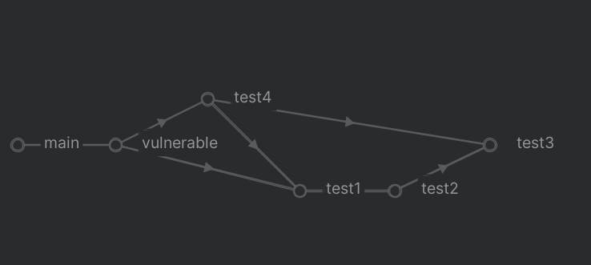

# TestCaseDroid

TestCaseDroid 是一个基于[Soot](https://github.com/soot-oss/soot)构建的项目，主要用于分析 Java 代码的可达性和构建调用图 (Call Graph)、控制流图 (Control Flow Graph) 和进程间控制流图 (Interprocedural Control Flow Graph)。

## 主要功能

1. **可达性分析**：通过 `Reachability*` 类，我们可以分析从一个方法到另一个方法是否可达。这对于理解代码的执行流程和找出潜在的代码问题非常有用。

2. **构建调用图**：通过 `BuildCallGraphForJar` 类，我们可以为指定的 Java 类或 Jar 文件构建调用图。

3. **构建控制流图**：通过 `BuildControlFlowGraph` 类，我们可以为指定的 Java 类构建控制流图。

4. **构建进程间控制流图**：通过 `BuildICFG` 类，我们可以为指定的 Java 类构建进程间控制流图。

## 如何使用

首先，你需要确保你的系统中已经安装了 Java 和 Maven，然后输出以下命令

```bash
mvn clean &&mvn install
```

然后，你可以通过以下命令来运行 TestCaseDroid：

```bash
java -jar TestCaseDroid-1.2.jar [options]
```

其中，`[options]` 是一系列的命令行选项，用于指定分析的类型、路径、类名等信息。具体的选项包括：

- `-p` 或 `--path`：指定要分析的 jar 包路径或者 class 文件路径。
- `-ec` 或 `--entryClass`：指定要分析的类名。
- `-sms` 或 `--sourceMethodSig`：指定要分析的源方法签名。
- `-tms` 或 `--targetMethodSig`：指定要分析的目标方法签名。
- `-g` 或 `--graph`：选择分析的图类型。
- `-r` 或 `--reachability`：选择可达性分析类型。
- `-b` 或 `--backward`：是否进行逆向分析。
- `-m` 或 `--method`：选择要分析的方法名。

**运行案例**

使用ICFG图搜索从源方法到目标方法的调用路径路径

输入参数

```bash
java -jar TestCaseDroid-1.2-jar-with-dependencies.jar -p E:\Tutorial\TestCaseDroid\target\classes\ -ec TestCaseDroid.test.Vulnerable -r icfg -sms "<TestCaseDroid.test.Vulnerable: void main(java.lang.String[])>" -tms  "<TestCaseDroid.test.ICFG: void test1()>"
```

实际的方法调用路径应如下



程序输出的路径结果

```bash
Reached node: virtualinvoke this.<TestCaseDroid.test.ICFG: void test2()>() in method: <TestCaseDroid.test.ICFG: void test1()>
Call stack: args := @parameter0: java.lang.String[]
 -> args := @parameter0: java.lang.String[]
 -> $stack2 = new TestCaseDroid.test.Vulnerable
 -> specialinvoke $stack2.<TestCaseDroid.test.Vulnerable: void <init>()>()
 -> virtualinvoke $stack2.<TestCaseDroid.test.Vulnerable: void vulnerable()>()
 -> this := @this: TestCaseDroid.test.Vulnerable
 -> $stack3 = <java.lang.System: java.io.PrintStream out>
 -> virtualinvoke $stack3.<java.io.PrintStream: void println(java.lang.String)>("--------------------")
 -> $stack4 = <java.lang.System: java.io.PrintStream out>
 -> virtualinvoke $stack4.<java.io.PrintStream: void println(java.lang.String)>("now in vulnerable")
 -> $stack5 = <java.lang.System: java.io.PrintStream out>
 -> virtualinvoke $stack5.<java.io.PrintStream: void println(java.lang.String)>("Start running the first test case")
 -> $stack6 = new TestCaseDroid.test.Test4
 -> specialinvoke $stack6.<TestCaseDroid.test.Test4: void <init>()>()
 -> virtualinvoke $stack6.<TestCaseDroid.test.Test4: void test4()>()
 -> $stack7 = <java.lang.System: java.io.PrintStream out>
 -> virtualinvoke $stack7.<java.io.PrintStream: void println(java.lang.String)>("End running the first test case")
 -> $stack8 = <java.lang.System: java.io.PrintStream out>
 -> virtualinvoke $stack8.<java.io.PrintStream: void println(java.lang.String)>("--------------------")
 -> $stack9 = <java.lang.System: java.io.PrintStream out>
 -> virtualinvoke $stack9.<java.io.PrintStream: void println(java.lang.String)>("Start running the second test case")
 -> $stack10 = new TestCaseDroid.test.ICFG
 -> specialinvoke $stack10.<TestCaseDroid.test.ICFG: void <init>()>()
 -> virtualinvoke $stack10.<TestCaseDroid.test.ICFG: void test1()>()
 -> this := @this: TestCaseDroid.test.ICFG
 -> $stack1 = <java.lang.System: java.io.PrintStream out>
 -> virtualinvoke $stack1.<java.io.PrintStream: void println(java.lang.String)>("now in test1")

Reached node: virtualinvoke this.<TestCaseDroid.test.ICFG: void test2()>() in method: <TestCaseDroid.test.ICFG: void test1()>
Call stack: args := @parameter0: java.lang.String[]
 -> args := @parameter0: java.lang.String[]
 -> $stack2 = new TestCaseDroid.test.Vulnerable
 -> specialinvoke $stack2.<TestCaseDroid.test.Vulnerable: void <init>()>()
 -> virtualinvoke $stack2.<TestCaseDroid.test.Vulnerable: void vulnerable()>()
 -> this := @this: TestCaseDroid.test.Vulnerable
 -> $stack3 = <java.lang.System: java.io.PrintStream out>
 -> virtualinvoke $stack3.<java.io.PrintStream: void println(java.lang.String)>("--------------------")
 -> $stack4 = <java.lang.System: java.io.PrintStream out>
 -> virtualinvoke $stack4.<java.io.PrintStream: void println(java.lang.String)>("now in vulnerable")
 -> $stack5 = <java.lang.System: java.io.PrintStream out>
 -> virtualinvoke $stack5.<java.io.PrintStream: void println(java.lang.String)>("Start running the first test case")
 -> $stack6 = new TestCaseDroid.test.Test4
 -> specialinvoke $stack6.<TestCaseDroid.test.Test4: void <init>()>()
 -> virtualinvoke $stack6.<TestCaseDroid.test.Test4: void test4()>()
 -> this := @this: TestCaseDroid.test.Test4
 -> $stack2 = <java.lang.System: java.io.PrintStream out>
 -> virtualinvoke $stack2.<java.io.PrintStream: void println(java.lang.String)>("now in test4")
 -> $stack3 = new TestCaseDroid.test.ICFG
 -> specialinvoke $stack3.<TestCaseDroid.test.ICFG: void <init>()>()
 -> virtualinvoke $stack3.<TestCaseDroid.test.ICFG: void test3()>()
 -> $stack4 = <java.lang.System: java.io.PrintStream out>
 -> virtualinvoke $stack4.<java.io.PrintStream: void println(java.lang.String)>("test4")
 -> virtualinvoke $stack3.<TestCaseDroid.test.ICFG: void test1()>()
 -> this := @this: TestCaseDroid.test.ICFG
 -> $stack1 = <java.lang.System: java.io.PrintStream out>
 -> virtualinvoke $stack1.<java.io.PrintStream: void println(java.lang.String)>("now in test1")
```


## 贡献

欢迎对 TestCaseDroid 项目进行贡献。如果你有任何问题或建议，可以通过 GitHub 提交 issue 或 pull request。

# TestCaseDroid

TestCaseDroid is a project built on [Soot](https://github.com/soot-oss/soot), mainly used for analyzing the reachability of Java code and building Call Graph, Control Flow Graph, and Interprocedural Control Flow Graph.

## Main Features

1. **Reachability Analysis**: Through the `ReachabilityICFG` class, we can analyze whether one method is reachable from another. This is very useful for understanding the execution flow of the code and finding potential code problems.

2. **Building Call Graph**: Through the `BuildCallGraphForJar` class, we can build a call graph for a specified Java class or Jar file.

3. **Building Control Flow Graph**: Through the `BuildControlFlowGraph` class, we can build a control flow graph for a specified Java class.

4. **Building Interprocedural Control Flow Graph**: Through the `BuildICFG` class, we can build an interprocedural control flow graph for a specified Java class.

## How to Use

First, you need to make sure that Java and Maven are installed on your system.

```bash
mvn clean &&mvn install
```

Then, you can run TestCaseDroid with the following command:

```bash
java -jar TestCaseDroid-1.2.jar [options]
```

Where, `[options]` is a series of command line options for specifying the type of analysis, path, class name, etc. The specific options include:

- `-p` or `--path`: Specify the path of the jar package or class file to be analyzed.
- `-ec` or `--entryClass`: Specify the class name to be analyzed.
- `-sms` or `--sourceMethodSig`: Specify the source method signature to be analyzed.
- `-tms` or `--targetMethodSig`: Specify the target method signature to be analyzed.
- `-g` or `--graph`: Select the type of graph to analyze.
- `-r` or `--reachability`: Select the type of reachability analysis.
- `-b` or `--backward`: Whether to perform reverse analysis.
- `-m` or `--method`: Select the method name to be analyzed.

## Contribution

Contributions to the TestCaseDroid project are welcome. If you have any questions or suggestions, you can submit an issue or pull request on GitHub.