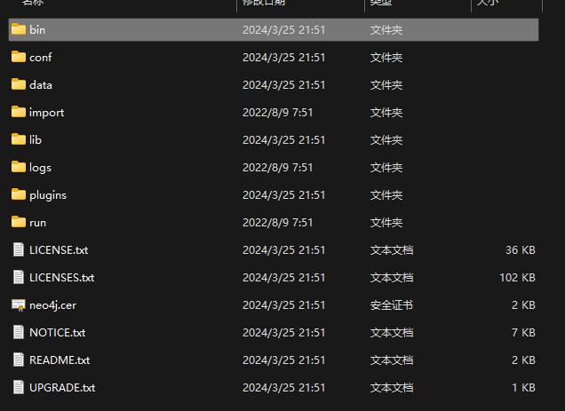
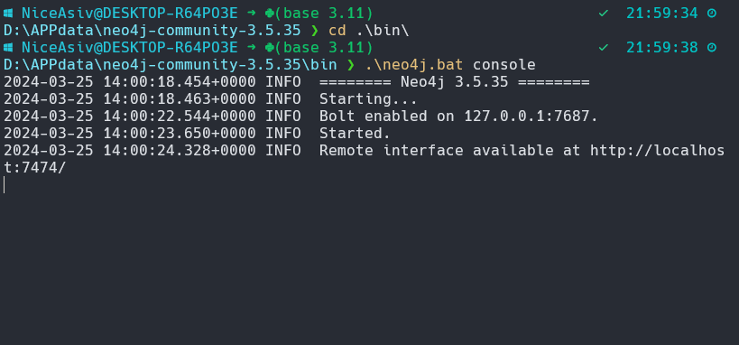
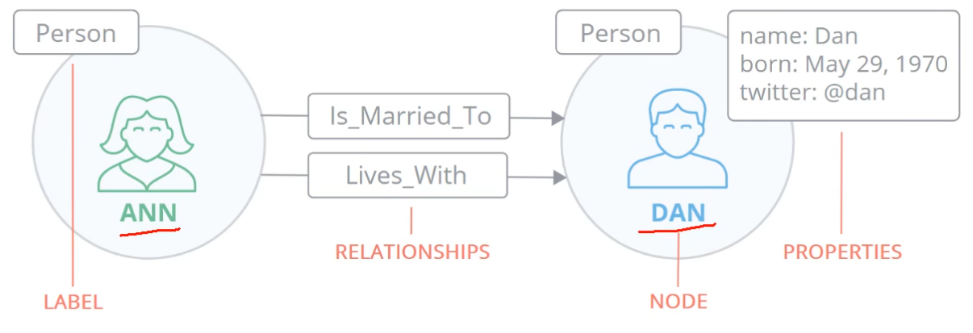

# Neo4j安装注意事项

Neo4j是一种先进的、开源的NoSQL==图数据库管==理系统，专为处理高度互联的数据而设计。不同于传统的基于表格的关系型数据库，Neo4j以图形模型为核心，数据以节点（Nodes）、关系（Relationships）和属性（Properties）的形式存储。每个节点代表一个实体，节点之间通过明确的关系相连，每个节点和关系都可以携带任意数量的属性来丰富数据表达。

- 专属查询语言==Cyber==

- 属性图模型

支持两种Java API ：Cyber API和Native Java API来开发Java应用程序

## 安装

### 设备环境

Java版本

```shell
openjdk version "1.8.0_402"
OpenJDK Runtime Environment Corretto-8.402.08.1 (build 1.8.0_402-b08)
OpenJDK 64-Bit Server VM Corretto-8.402.08.1 (build 25.402-b08, mixed mode)
```

操作系统

```shell
Windows 11
```

常见的neo4版本与java版本对应：

### 下载

这里选择国内代理商的镜像下载：

下载链接https://we-yun.com/doc/neo4j/3.5.35/

解压到本地：



### 启动服务

#### 打开终端启动neo4j

```shell
cd .\bin\
.\neo4j.bat console
```



#### 访问后台

打开链接http://localhost:7474/登录`neo4j`

默认账号密码是：neo4j，neo4j

#### 添加至环境变量(可选)

在系统变量区域，新建环境变量，命名为**NEO4J_HOME**，变量值设置为**neo4j的安装路径**

编辑系统变量区的Path，点击新建，然后输入 `%NEO4J_HOME%\bin`即可

#### 命令操作cyber

```shell
cypher.shell -u neo4j -p 123456
```


## 原理介绍

**对比关系型数据库**

| 关系型数据库 | 图数据库   |
| ------------ | ---------- |
| 表           | 图         |
| 行           | 节点       |
| 列和数据     | 属性和数据 |
| 约束         | 关系       |


### Neo4j的构建元素

**节点 (Node)**

- 节点是图数据库中的基本单元，代表一个实体或对象。在Neo4j中，每个节点都有一个唯一的标识符，并且可以存储一组键值对形式的属性。例如，一个人节点可以有姓名、年龄和职业等属性。

**属性 (Properties)**

- 属性是用来描述节点或关系特征的关键值对。每个节点和关系都可以具有零个或多个属性。属性为数据提供了额外的上下文和描述信息。

**关系 (Relationship)**

- 关系在节点之间建立连接，明确表示实体之间的关联。Neo4j中的关系是有方向性和类型的，它们也可以有自己的属性。例如，两个节点之间可以有一个`朋友`关系，这个关系可以有一个开始节点、结束节点，还可以包含创建日期这样的属性。

**标签 (Label)**

- 标签用于对节点进行分类或标记，使得同一类别的节点可以被轻松识别和查询。一个节点可以有零个、一个或多个标签，例如，一个节点可以同时拥有`Person`和`Employee`两个标签。




**Cypher查询语言**

- Cypher是Neo4j的声明式查询语言，用于查询和更新图形数据。它支持丰富的语法来寻找路径、过滤节点、创建和删除节点与关系，以及其他复杂图遍历操作。


**数据浏览器**

- Neo4j提供了一个内置的数据浏览工具——Neo4j Browser，它允许用户可视化地探索和修改数据库中的图形结构，同时也支持输入Cypher查询并查看结果。

## 数据库操作

**对于Neo4j早期版本（不支持多数据库功能）：**

**(1) 创建与切换数据库**

- **创建数据库**：

  - 手动在`neo4j/data/databases`目录下创建一个新的空文件夹，作为新的数据库存储位置，假设你将其命名为`new_database`。

  - 修改配置文件：在`neo4j/conf/neo4j.conf`中设置默认使用的数据库：

    ```shell
    dbms.active_database=new_database
    ```

  - 注意，重启Neo4j服务器前要确保新的数据库文件夹为空，或者包含正确的Neo4j数据库结构。

- **切换数据库**：

  - 同样是通过修改上述配置文件中的`dbms.active_database`参数，然后关闭并重启Neo4j服务器以使变更生效。

**(2) 删除数据库**

- 直接删除对应数据库的物理文件夹，通常是`neo4j/data/databases/数据库名`。删除后，相应的数据库将不再存在。

**对于Neo4j 4.x及以上版本（支持多数据库功能）：**

**(1) 创建与切换数据库**

- **创建数据库**：

  - 无需手动创建文件夹，可以直接通过Cypher命令或Neo4j Desktop、Neo4j Browser创建新的数据库：

    Cypher

    ```cypher
    CALL db.createDatabase("new_database")
    ```

- **切换数据库**：

  - 可以在客户端或浏览器中指定要连接的数据库名称，无需重启服务器：

    Cypher

    ```cypher
    :use new_database
    ```

**(2) 删除数据库**

- 通过Cypher命令删除数据库：

  ```cypher
  CALL db.dropDatabase("new_database")
  ```

## CQL使用

在CyberQL中节点通常用圆括号 `()` 表示，关系则用中括号 `[]` 表示，并且通过 `-` 符号连接节点来形成关系链路比如：

```CQL
(asiv)-[:knows]->(bsiv)-[:knows]->(csiv)
```

下面内容可参照[官方文档](https://neo4j.com/docs/cypher-manual/3.5/introduction/)进行查看

### 创建（CREATE）

1. 创建节点：
   ```cypher
   CREATE (n:Person {name: 'Alice', age: 30})
   ```

2. 创建关系：
   ```cypher
   MATCH (a:Person), (b:Person)
   WHERE a.name = 'Alice' AND b.name = 'Bob'
   CREATE (a)-[:KNOWS]->(b)
   ```

### 匹配（MATCH）

3. 查找所有`Person`节点：
   ```cypher
   MATCH (p:Person)
   RETURN p
   ```

4. 查找特定关系：
   ```cypher
   MATCH (a:Person)-[:FRIEND_OF]->(b:Person)
   RETURN a, b
   ```

### 返回（RETURN）

5. 返回节点属性：
   ```cypher
   MATCH (p:Person {name: 'Alice'})
   RETURN p.age AS AliceAge
   ```

### 条件（WHERE）

6. 添加条件过滤：
   ```cypher
   MATCH (p:Person)
   WHERE p.age > 30
   RETURN p
   ```

### 删除（DELETE & REMOVE）

7. 删除节点及其所有关系：
   ```cypher
   MATCH (p:Person {name: 'Alice'})
   DETACH DELETE p
   ```

8. 移除节点属性：
   ```cypher
   MATCH (p:Person {name: 'Alice'})
   REMOVE p.age
   ```

### 更新（SET）

9. 更新节点属性：
   ```cypher
   MATCH (p:Person {name: 'Alice'})
   SET p.age = 31
   ```

### 聚合（AGGREGATION）

10. 使用聚合函数：
    ```cypher
    MATCH (p:Person)
    RETURN COUNT(p) AS TotalPersons
    ```

### 其他命令

11. 组合命令：
    ```cypher
    MATCH (a:Person)-[:WORKS_AT]->(c:Company)
    WHERE a.name = 'Alice'
    CREATE (a)-[:LIVES_IN]->(:City {name: 'New York'})
    WITH a
    SET a.address = 'NY Address'
    ```


## 参考链接

[1] [超详细neo4j安装教程-CSDN博客](https://blog.csdn.net/qq_38335648/article/details/115027676)

[2] [【Neo4j教程天花板】独家仅一套视频搞定Neo4j高性能图数据库从入门到实战--Neo4j领跑数据库新赛道_哔哩哔哩_bilibili](https://www.bilibili.com/video/BV1sG411s7zV/?spm_id_from=333.337.search-card.all.click&vd_source=69621f7081851878cc366d89bdac5828)